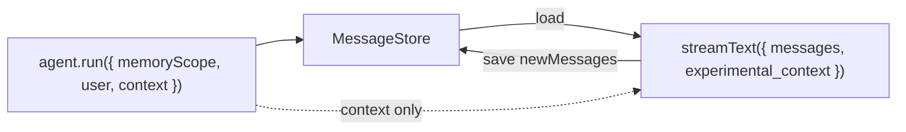

`MessageStore` persists **conversation history** (`CoreMessage` lists) keyed by `memoryScope`. It is separate from workflow observability storage.

## Implementation status

| Item                          | Status          |
| ----------------------------- | --------------- |
| `MessageStore` interface      | Implemented     |
| `inMemoryMessageStore()`      | Implemented     |
| Agent runner `load` / `save`  | Implemented     |
| SQLite / Drizzle-backed store | Not implemented |

Default: `createAdlRuntime()` uses `inMemoryMessageStore()` when `stores.message` is omitted.

## Memory vs observability

|                | **MessageStore**                       | **WorkflowStore / observers**   |
| -------------- | -------------------------------------- | ------------------------------- |
| **Consumer**   | The **model** on next `agent.run`      | Humans, inspection UI, OTEL     |
| **Question**   | “What should the next prompt contain?” | “What happened, in what order?” |
| **Shape**      | `CoreMessage[]` per `memoryScope`      | Append-only **run events**      |
| **Lifecycle**  | Many invocations per scope             | Tied to runs / steps            |
| **Mutability** | Read–merge–write transcript            | Mostly append-only              |

When messages are committed, the agent runner does **both**:

1. **`MessageStore.save`** — authoritative transcript.
2. **`agent_messages_committed`** run event — for UI/replay (may be redacted).

Do **not** rebuild agent memory by replaying observability events.

## Interface

```ts
import type { CoreMessage } from "ai";

export interface MessageStore {
  load(memoryScope: string): Promise<CoreMessage[]>;
  save(memoryScope: string, messages: CoreMessage[]): Promise<void>;
}
```

### Append semantics (runner)

1. `const stored = await store.load(memoryScope)`
2. Bootstrap system message if needed (once per scope)
3. Append `user` / model `response.messages`
4. `await store.save(memoryScope, updated)`

## Role in the system

- **`memoryScope`** (string) → one message list.
- **`context`** on `agent.run()` → **not** stored here; passed to tools via `experimental_context`.
- **Templates** → produce strings; runner writes system/user messages.



## Wiring

Configure in `src/adl.ts`:

```ts
export const adl = createAdlRuntime({
  stores: { message: inMemoryMessageStore() },
});
```

Per-agent override via `createAgent({ memory: { store } })` or factory overrides.

See [Agents](/core/agents/) for `memoryScope` conventions and [Observability](/core/observability/) for run events.
