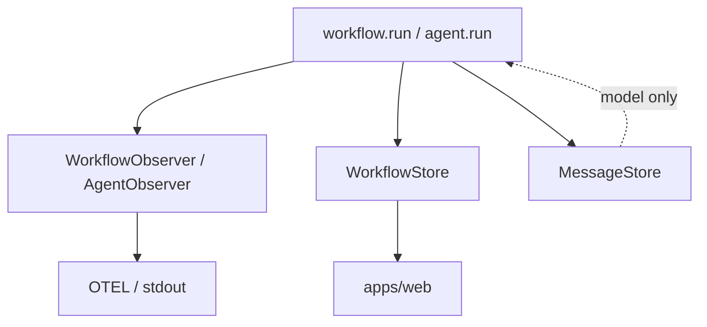

**Observers** = push-only hooks (stdout, OTEL, custom loggers). **No retrieval.**

**WorkflowStore** = persistence + query for UI, step caching, and event replay.

**MessageStore** = model conversation state — see [Message store](/core/message-store/).

## Why separate observer vs store

|                     | **WorkflowObserver**   | **WorkflowStore**                     |
| ------------------- | ---------------------- | ------------------------------------- |
| **Direction**       | Push only              | Write during run + **read** later     |
| **Implementations** | console, OTEL, Datadog | in-memory (default), SQLite (planned) |
| **Required?**       | No                     | No                                    |
| **Used by**         | Telemetry pipelines    | `apps/web`, CLI history, resumers     |
| **Retrieval**       | **None**               | `getRun`, `listRuns`, `listEvents`, … |

Same event at runtime, two optional sinks:

```ts
// RunRecorder (conceptual)
await workflowStore?.recordEvent(event);
await fanOut(observers.workflows, event);
```



## Observers

Single `onEvent` method with discriminated unions — no getters.

```ts
interface WorkflowObserver {
  onEvent?(event: WorkflowObserverEvent): void | Promise<void>;
}

interface AgentObserver {
  onEvent?(event: AgentObserverEvent): void | Promise<void>;
}
```

`onMessagesCommitted` notifies telemetry that memory was updated; it does **not** replace `MessageStore`.

## WorkflowStore

Persistence for **workflow and step I/O**, plus **append-only run events**.

**Resume logic reads I/O tables** via `getStepOutput`, not only event payloads.

### What gets stored

| Entity     | Written when               | Stored fields                                       |
| ---------- | -------------------------- | --------------------------------------------------- |
| **Run**    | `workflow.run` start / end | `workflowId`, `input`, `output`, status, timestamps |
| **Step**   | `ctx.step` complete / fail | `stepId`, slot identity, `output`, error            |
| **Events** | Lifecycle + `ctx.emit`     | Append-only `RunEvent[]`                            |

### Interface (summary)

```ts
interface WorkflowStore {
  recordEvent(event: RunEvent): Promise<void>;

  getRun(runId: string): Promise<WorkflowRunSummary | null>;
  listRuns(filter?: { workflowId?: string; limit?: number }): Promise<WorkflowRunSummary[]>;
  getRunInput(runId: string): Promise<unknown | null>;
  getRunOutput(runId: string): Promise<unknown | null>;

  getStepOutput(
    runId: string,
    slot: { parentStepId: string | null; name: string; key?: string },
  ): Promise<unknown | null>;

  listEvents(scope: ListEventsScope, filter?: ListEventsFilter): Promise<RunEvent[]>;
}
```

Default implementation: `inMemoryWorkflowStore()`. SQLite in `@agent-dev-lab/common` is planned but not shipped.

## RunRecorder

Central event sink. For each event it:

1. Assigns `seq` + `at` metadata
2. Records on the active OTel span (if any)
3. Persists via `WorkflowStore.recordEvent` (if configured)
4. Notifies observers via `onEvent`

Errors in observers: log and continue. Errors in store: log, do not throw.

## Three storage roles

| Interface                            | Push | Pull   | Purpose                     |
| ------------------------------------ | ---- | ------ | --------------------------- |
| `WorkflowObserver` / `AgentObserver` | Yes  | **No** | Logs, traces                |
| `WorkflowStore`                      | Yes  | Yes    | UI, SSE, step skip metadata |
| `MessageStore`                       | Yes  | Yes    | Model conversation          |

## Project wiring

Stores and observers belong in a **runtime module** referenced from `adl.config` — not required to be `src/adl.ts`. See [Runtime](/core/runtime/) and [Project setup](/guides/project-setup/).

## WorkflowResumer (deferred)

Higher-level helper for resumability — reads `WorkflowStore`, not an observer. See `notes/resumability.md` for agent-oriented design notes.

## Not yet implemented

- Default SQLite `WorkflowStore` in `@agent-dev-lab/common`
- Bundled OTEL exporter package
- Inspection UI reading from `WorkflowStore` (scaffolding only in `apps/web`)

See [Streaming](/core/streaming/) for event shapes and planned SSE routes.
