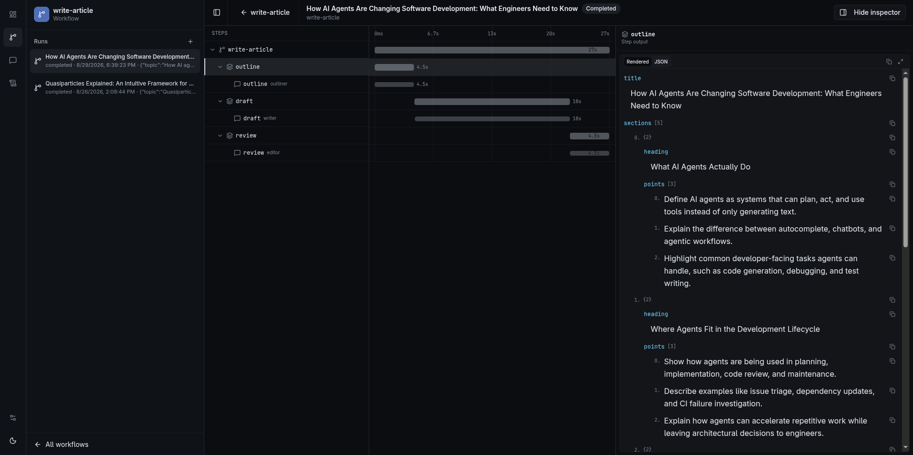

The inspection UI (`@agent-dev-lab/web`) is how you **start, watch, and replay** runs for an ADL project. It does not execute workflows itself: it calls `loadAdlProject()`, then `workflow.run` / `agent.run`, and tails persisted [`RunEvent`](/api/type-aliases/runevent/)s.



## Open the Inspector

From a project with `adl.config.*`:

```bash
bunx adl dashboard
bunx adl dashboard --serve
bunx adl dashboard --project ../other-research
```

The header shows the project **name**. Editing agents, workflows, or templates updates the catalog as soon as the dashboard process is running (a browser tab is not required). The process prints `[adl] watching <project>` once the watcher is armed, then a Vite-shaped `[adl] reload <file>` (or `[adl] reload failed`) on each change. `--serve` / `-s` turns watching off (`ADL_PROJECT_WATCH=0`); restart after those edits. Changing `.env*` always needs a restart. `--project` / `-p` points at another directory that contains `adl.config.*`. `--prebuilt` / `-b` forces the shipped Nitro UI instead of Vite — published `@agent-dev-lab/web` already has no Vite tree, so a normal install serves Nitro without the flag. Port is `--port` / `-P` (`-p` is already `--project`); if that port is taken, the next free port is used. `--strictPort` fails instead of hopping.

Standalone CLI commands (`adl workflow run`, `adl agent run`, `adl workflow list`, etc.) are separate processes: they load the project once and exit.

## Workflows

Registered ids come from `adl.config` `workflows`. The sidebar lists startable workflows and past runs (title from `ctx.setTitle` when set).

1. Open a workflow and start a run. If the workflow has a Zod `inputSchema`, the start dialog and the workflow page (when no run is selected) edit the whole input as a document, including raw JSON. Defaults apply. Schema and JSON parse errors appear on submit, not while typing. The form does not collect tags.
2. The run page is a **waterfall**: steps, nested workflow runs, parallel keyed steps, and agent episodes. A nested `workflow.run()` sits under the calling step, or under the workflow row when the call is at the root. Expand a nest to load its steps. The sidebar defaults to root runs; **Non-Root** lists nested runs, and a child run page links back to its parent.
3. Select a step or agent call for output, errors, and the conversation transcript for that `memoryScope`. Tags from `workflow.run(input, { tags })` / `agent.run({ tags })`, plus the automatic `version:` or `commit:` tag, appear in a footer on the inspector. There is no run-list tag filter.
4. **Retry** (run header or the workflow-row menu) and **Retry from here** (step menu or step inspector) seed a new attempt. The prior run stays in the list. Retry is unavailable while any run in that attempt forest is still running. Copied steps link back to the original and keep the prior attempt's duration on the waterfall.
5. **Cancel** calls `handle.cancel()`, which aborts `ctx.signal`, in-flight `ctx.step` bodies, nested workflow runs, and child `agent.run` / `streamText` calls on that run. Cancelling a nested run id aborts the active root. Isolated helper runs (for example conversation `titleWorkflow`) are not cancelled with the parent.

Live updates use **SSE** (`GET /api/runs/:runId/events?afterSeq=`). Reconnects replay from the last applied `runSeq`. History is always the SQLite (or in-memory) [`WorkflowStore`](/api/interfaces/workflowstore/), so you can reopen a finished run later.

Helpers that you **do not** put in `workflows: []` still persist if they `run()`, but they do not appear as startable targets or in the default run list. Conversation [`titleWorkflow`](/core/agents/#conversation-titles) uses `{ isolated: true }` so naming a chat does not inject steps into another workflow's tree.

## Agents

Registered `agents` can be opened as **conversations** (standalone `memoryScope`s), not only as nodes inside a workflow.

- New chat → `agent.run()` (AI SDK [`stopWhen`](https://ai-sdk.dev/docs/agents/loop-control), default `stepCountIs(20)`); first successful turn may set a title via `titleWorkflow`. Tool call/result events still fire while the model works.
- Conversation and workflow-run sidebars show **provider-reported token totals** rolled up from finished episodes (`streamText.totalUsage` on `agent_finished`). Counts may omit cache/reasoning fields when the provider does not report them; there is no dollar estimate yet. The conversation settings panel and workflow step inspector also show usage for the open conversation / selected agent call.
- **Fork** from a workflow agent episode copies that transcript into a new conversation you can continue.
- Shared scopes show history **up to** the selected episode; later turns are muted so you can see what the model had at that call.
- The agent settings panel reports effective **model** (id + provider when the LanguageModel exposes them), **memory** backend kind (`sqlite` / `in-memory` / custom), tools, `stopWhen` (`default` / `custom`), and title workflow id. When `tools` is a [`ToolProvider`](/core/tool-provider/), the panel also shows a **Tool context** form built from `contextSchema` (or a JSON field if that schema is missing / not an object). Each standalone message sends that value as `toolProviderContext`. There is no cwd default. The draft is seeded from the latest local episode, else the fork source episode, else an inspector-only agent default (editable on the agent definition page). Unsaved draft edits do not survive a full reload. Selecting `?call=` (or **View tool context** from the chat / event-log context menu) shows that episode’s immutable snapshot; **Copy to next turn** fills the draft on standalone and forked chats. Workflow-linked conversations stay read-only but display the episode snapshot; the editable form is for standalone and forked chats.

## Event Log

The **Event Log** page (`/events`) is a process-wide tail of every `RunEvent` the inspector has seen — workflow runs and standalone agent conversations — not one run at a time.

- Open it from the home sidebar or the rail. The context sidebar is hidden so the table can use the full width.
- Live updates use **SSE** (`GET /api/events?afterSeq=`). The stream id is the process `logSeq`, not per-run `runSeq`. Reconnects replay from the last applied `logSeq`.
- On inspector start, an empty in-memory buffer is **hydrated** from the last 100 persisted workflow runs and standalone agent episodes in [`WorkflowStore`](/api/interfaces/workflowstore/). **Clear** empties the in-memory view only; persisted runs stay. Restart hydrates again.
- Default filters hide `agent_text_delta`. Add field clauses (equals / not-equals / contains on strings / exists / empty). Click a name to open that run, conversation, call, or step — conversations highlight the matching transcript slice (`?call=`). Right-click a value to filter; ⋯ opens the full JSON payload.
- The footer paginates the filtered list (oldest page first; page 1 is the live tail when you stay on it).

The log is a ring buffer (default 10_000 events). It is not a durable store of its own — durability is still `WorkflowStore`.

## What Is Not in the Inspector Yet

- A template playground (edit/render `createTemplate` markdown in the UI)
- A dedicated raw token-debug pane (assistant text already streams via `agent_text_delta` in chat/run views)
- Manual runs of `adl.config.tools` (registry-only today; runtime merge is `createAdlRuntime({ tools })`)
- A start-run tag picker or a run-list tag filter (tags are a TypeScript `run` option; the inspector only displays them)
