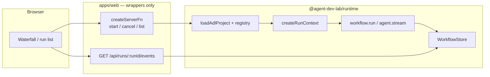

# Inspection UI (`apps/web`) — implementation notes

How the TanStack Start inspection UI talks to the runtime, plus **takeaways** from [t3code](https://github.com/pingdotgg/t3code) and [TanStack AI](https://tanstack.com/ai/latest/docs) to apply when we build the web UI.

**Status:** Design only. Not implemented.

**Agreed approach:** **server functions (control plane) + SSE with ADL `RunEvent`s (data plane)**, implemented only in **`apps/web` wrappers**—never injected into user `createAgent` / `createWorkflow` code.

Related: [`streaming-api.md`](./streaming-api.md), [`observability-api.md`](./observability-api.md), [`v1-scope.md`](./v1-scope.md), [`ai-sdk-compatibility.md`](./ai-sdk-compatibility.md).

---

## Architecture (control vs data plane)



| Plane         | Mechanism                                                | Examples                                                             |
| ------------- | -------------------------------------------------------- | -------------------------------------------------------------------- |
| **Control**   | TanStack Start **server functions** (typed, short-lived) | `startInspectionRun`, `cancelRun`, `listRuns`, `listAgents`          |
| **Data**      | **API route** SSE tail of persisted events               | `GET /api/runs/:runId/events?afterSeq=`                              |
| **Hydration** | GET snapshot (route or server fn)                        | `GET /api/runs/:runId`, optional initial events in first SSE message |

**Rules**

- Wrappers call the **same** `loadAdlProject` / `getWorkflow` / `getAgent` path as the CLI—no web-only agent definitions.
- Execution and event emission live in **runtime** (`executeAgentEpisode`, observers, `WorkflowStore.recordEvent`); wrappers only start work and expose HTTP.
- Return **`{ runId }` immediately** from start; do not block the server fn on `workflow.run` completion.
- Defer **`@agent-dev-lab/hooks`** and chat-style hooks until the inspector works without them.

See [`streaming-api.md` — Getting data to apps/web](./streaming-api.md#getting-data-to-appsweb-no-runhandle) for run-event channels (`step_*` vs `agent_text_delta`).

---

## SSE wire format (ADL, not TanStack AI chunks)

Encode persisted **`RunEvent`** JSON only. Do **not** adopt TanStack AI [StreamChunk / AG-UI](https://tanstack.com/ai/latest/docs/protocol/chunk-definitions) or `@tanstack/ai` as the runtime.

**Borrow from [TanStack AI SSE protocol](https://tanstack.com/ai/latest/docs/protocol/sse-protocol):**

- Headers: `Content-Type: text/event-stream`, `Cache-Control: no-cache`, `Connection: keep-alive`
- Body lines: `data: ${JSON.stringify(event)}\n\n` (double newline between events)
- Send an error event (or `run_failed`) before closing on server errors
- Debug with `curl -N` and DevTools Network → event stream

**Do not copy TanStack AI’s simplifications** (they skip SSE `id:` because one POST = one chat stream). ADL needs:

- Monotonic **`seq`** on every `RunEvent` (see `packages/core` / [`streaming-api.md`](./streaming-api.md))
- SSE **`id: <seq>`** per event for `Last-Event-ID` / reconnect
- **`?afterSeq=`** on GET for polling fallback and gap fill
- Stream ends when **`run_finished` / `run_failed` / `run_cancelled`** is persisted—not only `data: [DONE]`

Optional small helper in `@agent-dev-lab/common` or `apps/web`: `encodeRunEventSse(event)` / `createRunEventSseStream(events)`—no dependency on `@tanstack/ai`.

---

## v1 web UI checklist

Aligns with [`v1-scope.md`](./v1-scope.md#inspection-ui-apps-web--implement-for-v1-minimal).

### Server (`apps/web`)

- [ ] Reuse [`getLoadedAdlProject`](../../apps/web/src/lib/adl-project.ts) in all wrappers
- [ ] `startInspectionRun` server fn → `createRunContext`, background `workflow.run`, return `{ runId }`
- [ ] `GET /api/runs` — list runs from `WorkflowStore`
- [ ] `GET /api/runs/:runId` — snapshot (status, step tree summary, error)
- [ ] `GET /api/runs/:runId/events` — SSE tail + `afterSeq`
- [ ] `cancelRun` server fn — `AbortSignal` wired through runtime
- [ ] Framework dev: `ADL_PROJECT_ROOT` / playground (see root `AGENTS.md`)

### Client (`apps/web`)

- [ ] Run list + run detail route(s)
- [ ] `EventSource` (or fetch stream) subscribed after `runId` known
- [ ] In-memory **reducer**: apply `RunEvent[]` → view model (step tree, agent rows)
- [ ] On reconnect: pass `afterSeq` from last applied `seq`
- [ ] Project banner from existing `/api/project`
- [ ] ⏸ Live token pane (`agent_text_delta`) — nice-to-have after waterfall
- [ ] ⏸ `@agent-dev-lab/hooks` — later

### Runtime prerequisite (not in `apps/web`)

- [ ] `WorkflowStore` append + `listEvents(runId, afterSeq?)` ([`observability-api.md`](./observability-api.md))
- [ ] Observers / internal bridge: `streamText` `onChunk` → `agent_text_delta` ([`streaming-api.md`](./streaming-api.md))

---

## Takeaways from t3code

Reference: [pingdotgg/t3code](https://github.com/pingdotgg/t3code) (`apps/web`, `apps/server`, `packages/contracts`). t3 uses **WebSocket RPC**, not SSE; translate patterns, not transport.

### Event log + UI projection

- **Append-only domain events** with monotonic **`sequence`**; UI is a **pure reducer** over events (t3: `applyOrchestrationEvent` in `store.ts`).
- **Snapshot first, then live tail** on subscribe (t3: `subscribeShell` / `subscribeThread` send `kind: "snapshot"` then events).
- **Ignore stale events**: only apply if `sequence > lastApplied` (t3: `shouldApplyProjectionEvent`).

### Streaming assistant text

- Provider deltas → persisted events with **`streaming: true`**; finalize with **`streaming: false`** (t3: `thread.message.assistant.delta` → `thread.message-sent`).
- Client reducer **appends** text while streaming: `existing.text + delta` (see t3 `thread.message-sent` handler).
- **Coalesce** consecutive streaming events for the same message id **before** React state updates (t3: `coalesceOrchestrationUiEvents` in `service.ts`) to avoid render storms.

### Server-side batching (optional, later)

- Buffer token deltas in memory with a max size; spill or flush on turn boundaries (t3: `MAX_BUFFERED_ASSISTANT_CHARS`, `enableAssistantStreaming` setting).
- ADL equivalent: optional dev setting on inspection server, not on user `adl.config`.

### Store shape (if using Zustand or similar)

- **Normalize** by id: e.g. `messageIdsByRunId` + `messageById` (t3 splits shell vs detail fields).
- **Stable derived arrays** (WeakMap caches in t3 `threadDerivation.ts`) so list components do not remount every token.
- **Stable list rows** during stream: reuse row objects when only `text` changed (t3: `computeStableMessagesTimelineRows`).

### Subscriptions

- **Do not subscribe globally** to all runs; subscribe per **open run** (t3: ref-counted `subscribeThread`, evict when idle).
- **Bootstrap gate**: wait for shell/snapshot before treating connection as ready (t3: `createEnvironmentConnection`).

### Gap recovery (plan for; t3 partially sketched)

- t3 has `replayEvents` RPC and `orchestrationRecovery.ts` (coordinator tested; **not fully wired** in web).
- ADL should implement from day one: **`afterSeq` replay** on reconnect + optional snapshot refresh—do not rely on a single non-resumable POST stream.

### What not to take from t3

- WebSocket + Effect RPC stack (ADL: SSE + TanStack Start routes).
- Chat timeline as the primary inspector (ADL: waterfall / step tree).
- Dual shell + thread projection complexity unless sidebar needs precomputed summaries.

---

## Takeaways from TanStack AI

Reference: [TanStack AI docs](https://tanstack.com/ai/latest/docs), [SSE protocol](https://tanstack.com/ai/latest/docs/protocol/sse-protocol).

### Useful

- SSE framing and HTTP headers (see [SSE wire format](#sse-wire-format-adl-not-tanstack-ai-chunks) above).
- TanStack Start also documents server-fn streaming ([ReadableStream / async generators](https://tanstack.com/start/latest/docs/framework/react/guide/streaming-data-from-server-functions))—optional for a **future playground tab only**, not the main run inspector.

### Do not adopt for ADL inspection UI

| TanStack AI piece                        | Why skip                                                                                                                    |
| ---------------------------------------- | --------------------------------------------------------------------------------------------------------------------------- |
| `@tanstack/ai` + provider adapters       | Duplicates **`ai`** + [`ai-sdk-compatibility.md`](./ai-sdk-compatibility.md)                                                |
| AG-UI `StreamChunk` as `RunEvent`        | Name collision (`STEP_*`, `RUN_*`) with **different semantics** (AG-UI “step” ≈ model reasoning; ADL `step_*` ≈ `ctx.step`) |
| POST `{ messages }` → SSE until `[DONE]` | One-shot chat; no durable **run log** or mid-run reconnect                                                                  |
| `@tanstack/ai-react` `useChat`           | Chat-centric; deferred per product direction                                                                                |
| SSE without event `id:`                  | Conflicts with **replay / `afterSeq`**                                                                                      |

If we ever add a **chat-shaped playground**, a dedicated route may use TanStack Start async-generator server fns—but it should still **write `RunEvent`s** if the run should appear in the inspector.

---

## Client reducer sketch (no hooks package)

Pseudocode for first UI slice:

```ts
type RunViewState = {
  lastSeq: number;
  steps: StepNode[];
  agents: Record<string, AgentEpisodeState>;
  status: "running" | "completed" | "failed";
};

function applyRunEvent(state: RunViewState, event: RunEvent): RunViewState {
  if (event.seq <= state.lastSeq) return state;
  // switch (event.type): step_*, agent_*, agent_text_delta (append), run_finished, ...
}
```

Coalesce `agent_text_delta` in a ref before calling `setState` if updates exceed ~1/frame.

---

## Open questions (web-specific)

- [ ] Server fn vs `POST /api/runs` for start (either ok; pick one primary, mirror in docs).
- [ ] Single SSE connection per tab vs per visible run (HTTP/1.1 connection limits).
- [ ] Whether first SSE message is a **snapshot** (`events[]` + `latestSeq`) or client GETs snapshot separately.
- [ ] Version skew: framework dev uses workspace runtime; user `adl dev` uses project `node_modules`—surface in UI banner if versions differ.

---

## Phasing (web work)

| Order | Work                                                            |
| ----- | --------------------------------------------------------------- |
| 1     | Runtime: `WorkflowStore` + emit `RunEvent`s on `workflow.run`   |
| 2     | `GET /api/runs/:id/events` SSE + manual `EventSource` test page |
| 3     | `startInspectionRun` server fn + minimal waterfall UI           |
| 4     | `agent_text_delta` transcript pane                              |
| 5     | Optional: hooks package, playground async-generator route       |

Matches [`streaming-api.md` v1 phasing](./streaming-api.md#v1-phasing) phases 1–2 for UI.
