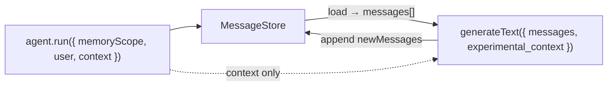

# Message store

How ADL persists **conversation history** (`CoreMessage` / `ModelMessage` lists) keyed by `memoryScope`.

## Current implementation status

| Item | Status |
|------|--------|
| `MessageStore` interface in `@agent-dev-lab/runtime` | **Not implemented** |
| `inMemoryMessageStore()` | **Not implemented** |
| SQLite / Drizzle-backed store | **Not implemented** (placeholder `runs` table in `@agent-dev-lab/common` is unrelated) |
| Agent runner `load` / `save` | **Not implemented** |

**What exists today in the runtime package:**

- Prompt loading/rendering: `loadPromptFile`, `resolvePromptPath`, `renderPromptTemplate` ([`packages/runtime/src/prompt/`](../packages/runtime/src/prompt/))
- Project config: `loadAdlProject`, `AdlProjectConfig` ([`packages/runtime/src/project/`](../packages/runtime/src/project/))
- AI SDK re-exports: `generateText`, `streamText`, `CoreMessage`, `LanguageModel` ([`packages/runtime/src/index.ts`](../packages/runtime/src/index.ts))

This document describes the **planned** store contract used by [`agent-api.md`](./agent-api.md). Update the status table when code lands.

---

## Role in the system

- **`memoryScope`** (string) → selects one message list in a store.
- **`context`** on `agent.run()` → **not** stored here; passed to tools via AI SDK `experimental_context` (see agent-api).
- **Templates** → produce strings; the agent runner writes **system** / **user** messages into the store (see agent-api).



---

## Planned interface (v1)

```ts
import type { CoreMessage } from "ai";

/**
 * Persistent or in-process storage for a single conversation transcript
 * keyed by memoryScope.
 */
export interface MessageStore {
  /** Returns the full transcript for this scope (empty array if new). */
  load(memoryScope: string): Promise<CoreMessage[]>;

  /**
   * Replaces the transcript for this scope.
   * v1 runner may implement via load + append + save; see below.
   */
  save(memoryScope: string, messages: CoreMessage[]): Promise<void>;
}
```

### Append semantics (runner responsibility)

The public store may stay **load/save** for simplicity. The agent runner is expected to:

1. `const stored = await store.load(memoryScope)`
2. Bootstrap system message if needed (once per scope)
3. Append `user` / `newMessages` from the model
4. `await store.save(memoryScope, updated)`

A future optional **`append(memoryScope, messages)`** on the interface can avoid read-modify-write races; not required for v1 playground/tests.

### What gets stored

- `system` — rendered agent `instructions` (once per scope; persisted verbatim for determinism)
- `user` — turn input from each `run()`
- `assistant` / `tool` — from `generateText` `result.response.messages` after each episode

Tool calls and results are **messages**, not a separate column or table in the store API.

---

## Planned built-in implementations

| Implementation | Use case |
|----------------|----------|
| `inMemoryMessageStore()` | Tests, local scripts; `Map<string, CoreMessage[]>` |
| `sqliteMessageStore(...)` (later) | Inspection UI, durable runs; likely shares SQLite with run events in `@agent-dev-lab/common` |

Default store: set on `defineAgent({ memory: { store } })` or project/runtime default when omitted.

---

## Generics (with agent API)

The store itself is **not** generic—only `CoreMessage[]`. Typing belongs on the agent:

```ts
const agent = defineAgent<MyContext, typeof myTools>({ ... });

await agent.run({
  memoryScope: "...",
  context: { resourceId: "u1" }, // typed as MyContext
});
```

See [`agent-api.md`](./agent-api.md) for `defineAgent` / `run` generics.

---

## Related

- Agent run flow and bootstrap: [`agent-api.md`](./agent-api.md)
- Deferred list shaping (last-N, summarize): [`memory-pipeline.md`](./memory-pipeline.md)
- Project principles: [`design-overview.md`](./design-overview.md)
