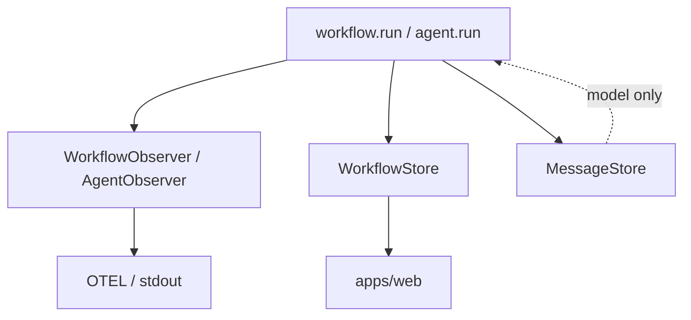

# Observability & run storage (draft)

**Observers** = push-only hooks (stdout, OTEL, custom loggers). **No retrieval.**

**Stores** = optional persistence + query for UI and resumability. **Entirely separate** from observers.

**Message store** = model conversation state ([`message-store.md`](./message-store.md)) — third interface.

**Status:** Design only.

Related: [`streaming-api.md`](./streaming-api.md), [`workflow-api.md`](./workflow-api.md), [`resumability.md`](./resumability.md), [`project-api.md`](./project-api.md).

---

## Why separate observer vs store

|                     | **`WorkflowObserver`**   | **`WorkflowStore`**                   |
| ------------------- | ------------------------ | ------------------------------------- |
| **Direction**       | Push only                | Write during run + **read** later     |
| **Implementations** | `console`, OTEL, Datadog | SQLite, Postgres, in-memory (tests)   |
| **Required?**       | No                       | No (skip if you only need logs)       |
| **Used by**         | Telemetry pipelines      | `apps/web`, CLI history, **resumers** |
| **Retrieval**       | **None** — no `getRuns`  | `getRun`, `listRuns`, `getEvents`, …  |

Same event at runtime, two optional sinks:

```ts
// Inside ctx.step (conceptual)
await Promise.all([
  fanOut(observers.workflow, "onStepStart", payload),
  workflowStore?.recordStepStart(payload),
]);
```

Observers stay thin so OTEL/stdout adapters never pretend to be databases.



---

## `WorkflowObserver` (push only)

All methods optional. **No getters.**

```ts
interface WorkflowObserver {
  onRunStart?(e: RunStartPayload): void | Promise<void>;
  onRunComplete?(e: RunCompletePayload): void | Promise<void>;
  onRunCancel?(e: RunCancelPayload): void | Promise<void>;
  onRunError?(e: RunErrorPayload): void | Promise<void>;

  onStepStart?(e: StepStartPayload): void | Promise<void>;
  onStepComplete?(e: StepCompletePayload): void | Promise<void>;
  onStepError?(e: StepErrorPayload): void | Promise<void>;

  onCustomEvent?(e: CustomEventPayload): void | Promise<void>;
}
```

Payload shapes match [`streaming-api.md`](./streaming-api.md) / [`workflow-api.md`](./workflow-api.md) (`runId`, `stepId`, `name`, `key`, `path`, …).

**Examples:** `ConsoleWorkflowObserver`, `OtelWorkflowObserver`.

---

## `AgentObserver` (push only)

Same rule: callbacks only, no reads.

```ts
interface AgentObserver {
  onAgentStart?(e: AgentStartPayload): void | Promise<void>;
  onMessages?(e: AgentMessagesPayload): void | Promise<void>;
  onStream?(e: AgentStreamPayload): void | Promise<void>;
  onToolCall?(e: ToolCallPayload): void | Promise<void>;
  onToolResult?(e: ToolResultPayload): void | Promise<void>;
  onMessagesCommitted?(e: MessagesCommittedPayload): void | Promise<void>;
  onAgentComplete?(e: AgentCompletePayload): void | Promise<void>;
  onAgentError?(e: AgentErrorPayload): void | Promise<void>;
}
```

`onMessagesCommitted` notifies telemetry that memory was updated; it does **not** replace [`MessageStore`](./message-store.md).

---

## `WorkflowStore` (write + read)

Persistence for **runs, steps, and run events** (waterfall, SSE, resume). Optional in `adl.config`.

### Write side (runtime calls — mirror observer moments)

Use **`record*`** names to distinguish from `on*` and from `ctx.step`:

```ts
interface WorkflowStore {
  recordRunStart(e: RunStartPayload): Promise<void>;
  recordRunComplete(e: RunCompletePayload): Promise<void>;
  recordRunCancel(e: RunCancelPayload): Promise<void>;
  recordRunError(e: RunErrorPayload): Promise<void>;

  recordStepStart(e: StepStartPayload): Promise<void>;
  recordStepComplete(e: StepCompletePayload): Promise<void>;
  recordStepError(e: StepErrorPayload): Promise<void>;

  recordCustomEvent(e: CustomEventPayload): Promise<void>;

  /** Optional: agent episodes under a step (if not only in MessageStore) */
  recordAgentEvent?(e: AgentRunEventPayload): Promise<void>;
}
```

Default SQLite impl in `@agent-dev-lab/common` can append a unified `run_events` table **or** normalized `runs` + `steps` tables—implementation detail, same interface.

### Read side

```ts
interface WorkflowStore {
  getRun(runId: string): Promise<RunSummary | null>;
  listRuns(filter?: { workflowId?: string; limit?: number }): Promise<RunSummary[]>;
  getRunEvents(runId: string, afterSeq?: number): Promise<RunEvent[]>;
}
```

`RunEvent` = transport-friendly union for SSE ([`streaming-api.md`](./streaming-api.md)). The store may derive events from `record*` calls internally.

**`apps/web`:** depends on **`WorkflowStore`**, not on observers.

---

## `WorkflowResumer` (optional, later)

Higher-level helper for [`resumability.md`](./resumability.md)—**reads** `WorkflowStore` (+ optionally `MessageStore`), not an observer.

```ts
interface WorkflowResumer {
  /** Steps that finished successfully with stored outputs */
  getCompletedSteps(
    runId: string,
  ): Promise<Array<{ stepId: string; name: string; key?: string; output: unknown }>>;

  /** Whether a run failed mid-flight and might be retried */
  getRunStatus(runId: string): Promise<RunSummary | null>;
}
```

Resume **logic** (skip steps, re-enter workflow) stays in user TypeScript or a future `workflow.resume(input, { continueFrom: runId })` that uses `WorkflowResumer` internally—v1 can ship **store + resumer** without automatic re-execution.

Do **not** extend `WorkflowObserver` with getters—keeps OTEL adapters honest.

---

## Three storage roles (summary)

| Interface                            | Push         | Pull       | Purpose                           |
| ------------------------------------ | ------------ | ---------- | --------------------------------- |
| `WorkflowObserver` / `AgentObserver` | Yes          | **No**     | Logs, traces                      |
| `WorkflowStore`                      | Yes (record) | Yes        | UI, SSE, workflow resume metadata |
| `MessageStore`                       | Yes (save)   | Yes (load) | Model conversation                |

---

## Project wiring

```ts
// adl.config.ts
export default {
  name: "my-research",

  workflows: {
    literatureReview,
  },

  observers: {
    workflows: [new OtelWorkflowObserver()],
    agents: [new OtelAgentObserver()],
  },

  stores: {
    workflows: createSqliteWorkflowStore({ db }),
    memory: createSqliteMessageStore({ db }),
  },
} satisfies AdlProjectConfig;
```

Per-run override:

```ts
createRunContext(project, {
  workflowObservers: [stdoutWorkflowObserver],
  workflowStore: project.config.stores?.workflows,
  messageStore: project.config.stores?.memory,
});
```

**Observers-only project:** omit `stores` (or omit individual keys) — execution works; no built-in run history without `stores.workflows`.

---

## Runtime fan-out

1. **`ctx.step`:** `onStepStart` → all workflow observers; `recordStepStart` → store if present. Same for complete/error.
2. **`ctx.emit`:** `onCustomEvent` + `recordCustomEvent`.
3. **`agent.run`:** agent observers + `MessageStore` commit; optionally `workflowStore.recordAgentEvent` for UI (deltas, tool calls).
4. Errors in observers: log and continue (configurable); errors in store: likely throw or retry (data integrity).

---

## Relationship to `RunEvent` / SSE

- **Observers** do not need to speak `RunEvent`.
- **WorkflowStore** is the natural place to persist `RunEvent[]` for `getRunEvents` + SSE tail.

Optional adapter: `createWorkflowStoreFromObserver()` is **not** the default pattern—prefer explicit `record*` on the store.

---

## Memory vs store vs observer

See [`message-store.md`](./message-store.md#memory-vs-observability-not-the-same-layer). Observability **observers** are not memory. **WorkflowStore** overlaps _audit_ data with observers but not _model_ transcripts—use **MessageStore** for prompts.

---

## v1 checklist

- [ ] `WorkflowObserver` + `AgentObserver` (no getters) in runtime
- [ ] `WorkflowStore` with `record*` + `getRun` / `listRuns` / `getRunEvents`
- [ ] Runtime fan-out: observers + store in parallel
- [ ] Default SQLite `WorkflowStore` in `@agent-dev-lab/common`
- [ ] `adl.config`: `observers.*`, `stores.workflows`, `stores.memory`
- [ ] `apps/web` SSE uses `WorkflowStore` only
- [ ] `WorkflowResumer` (optional, can defer)

---

## Open questions

- Single `WorkflowStore` vs split `RunEventStore` + `StepStore` (keep one interface until pain).
- Whether agent stream deltas go to store only, observer only, or both (default: both when configured).
- Sync vs async observers vs store write ordering (store after observer? parallel?).
