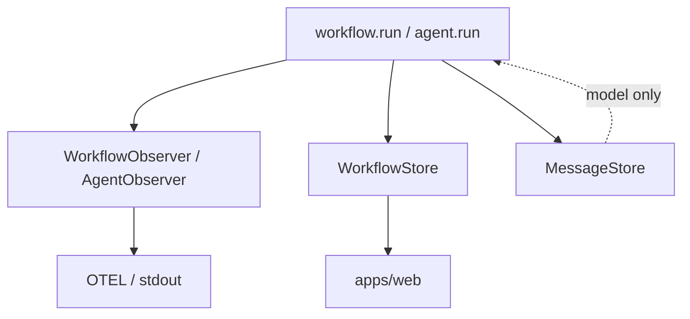

# Observability & run storage (draft)

**Observers** = push-only hooks (stdout, OTEL, custom loggers). **No retrieval.**

**Stores** = optional persistence + query for UI and resumability. **Entirely separate** from observers.

**Message store** = model conversation state ([`message-store.md`](./message-store.md)) — third interface.

**Status:** Core implementation in `@agent-dev-lab/core` (observers, in-memory store, `RunRecorder`).

Related: [`streaming-api.md`](./streaming-api.md), [`workflow-api.md`](./workflow-api.md), [`resumability.md`](./resumability.md), [`project-api.md`](./project-api.md), [`tracing.md`](./tracing.md).

---

## Why separate observer vs store

|                     | **`WorkflowObserver`**   | **`WorkflowStore`**                   |
| ------------------- | ------------------------ | ------------------------------------- |
| **Direction**       | Push only                | Write during run + **read** later     |
| **Implementations** | `console`, OTEL, Datadog | SQLite, Postgres, in-memory (tests)   |
| **Required?**       | No                       | No (skip if you only need logs)       |
| **Used by**         | Telemetry pipelines      | `apps/web`, CLI history, **resumers** |
| **Retrieval**       | **None** — no `getRuns`  | `getRun`, `listRuns`, `getEvents`, …  |

Same event at runtime, two optional sinks:

```ts
// Inside ctx.step (conceptual)
await Promise.all([
  fanOut(observers.workflow, "onStepStart", payload),
  workflowStore?.recordStepStart(payload),
]);
```

Observers stay thin so OTEL/stdout adapters never pretend to be databases.



---

## `WorkflowObserver` (push only)

All methods optional. **No getters.**

```ts
interface WorkflowObserver {
  onEvent?(event: WorkflowObserverEvent): void | Promise<void>;
}
```

Single `onEvent` method with a discriminated union. Adding new event types does not require interface changes — consumers `switch (event.type)`. Optional helper `createWorkflowObserver({ onStepStart, ... })` can provide per-event-type ergonomics on top.

Payload shapes match [`streaming-api.md`](./streaming-api.md) / [`workflow-api.md`](./workflow-api.md) (`runId`, `stepId`, `name`, `key`, `path`, …).

**Examples:** `ConsoleWorkflowObserver`, `OtelWorkflowObserver`.

---

## `AgentObserver` (push only)

Same rule: callbacks only, no reads.

```ts
interface AgentObserver {
  onEvent?(event: AgentObserverEvent): void | Promise<void>;
}
```

Same single-method pattern as `WorkflowObserver`.

`onMessagesCommitted` notifies telemetry that memory was updated; it does **not** replace [`MessageStore`](./message-store.md).

---

## `WorkflowStore` (write + read)

Persistence for **workflow and step inputs/outputs**, plus **run events** (waterfall, SSE). This is the **source of truth for step skip / retry**, not just an audit log. Optional in `adl.config`.

**Design principle:** to avoid re-running a completed step, `ctx.step` **early-returns** the stored **output** for that step slot (see [`workflow-api.md`](./workflow-api.md)). Events remain useful for the UI timeline; **resume logic reads I/O tables**, not only `step_finished` event payloads.

### What gets stored

| Entity     | Written when                | Stored fields (JSON-safe)                                                                                          |
| ---------- | --------------------------- | ------------------------------------------------------------------------------------------------------------------ |
| **Run**    | `workflow.run` start / end  | `workflowId`, **`input`**, **`output`**, status, timestamps                                                        |
| **Step**   | `ctx.step` complete / fail  | `stepId`, `parentStepId`, `name`, `key`, `path`, optional **`input` snapshot**, **`output`** (return value), error |
| **Events** | Same lifecycle + `ctx.emit` | Append-only `RunEvent[]` for SSE / waterfall                                                                       |

Step **inputs** are optional metadata (e.g. logged by nested `workflow.run` with declared Zod input). Step **outputs** are **required** on successful completion — they power skip-on-retry.

### Write side (runtime calls)

Single `recordEvent(event)` method — consistent with the observer `onEvent` pattern. The `RunRecorder` calls this alongside observer fan-out.

```ts
interface WorkflowStore {
  recordEvent(event: RunEvent): Promise<void>;
}
```

Single `recordEvent` method — consistent with the observer `onEvent` pattern. The store internally dispatches by event type to update run/step tables and the append-only event log.

Default SQLite impl in `@agent-dev-lab/common`: normalized **`runs`** + **`steps`** tables (I/O columns) **and** optional **`run_events`** append log. Same public interface either way.

### Read side

```ts
interface WorkflowStore {
  getRun(runId: string): Promise<RunSummary | null>;
  listRuns(filter?: { workflowId?: string; limit?: number }): Promise<RunSummary[]>;

  /** Workflow-level I/O */
  getRunInput(runId: string): Promise<unknown | null>;
  getRunOutput(runId: string): Promise<unknown | null>;

  /**
   * Completed step by logical slot (parent + name + key).
   * Used by ctx.step to skip re-execution on resume/retry.
   */
  getStepOutput(
    runId: string,
    slot: { parentStepId: string | null; name: string; key?: string },
  ): Promise<unknown | null>;

  /** By unique invocation id */
  getStepById(runId: string, stepId: string): Promise<StepRecord | null>;

  listEvents(scope: ListEventsScope, filter?: ListEventsFilter): Promise<RunEvent[]>;
}

type StepRecord = {
  stepId: string;
  name: string;
  key?: string;
  path: string[];
  parentStepId: string | null;
  input?: unknown;
  output?: unknown;
  status: "ok" | "error";
};
```

`RunEvent` = transport-friendly union for SSE ([`streaming-api.md`](./streaming-api.md)). Events may be **projections** of `record*` calls; **do not** rely on scraping events alone for resume — use `getStepOutput` / `getRunInput`.

**`apps/web`:** depends on **`WorkflowStore`**, not on observers.

---

## `WorkflowResumer` (optional, later)

Higher-level helper for [`resumability.md`](./resumability.md)—**reads** `WorkflowStore` (+ optionally `MessageStore`), not an observer.

```ts
interface WorkflowResumer {
  getRunInput(runId: string): Promise<unknown | null>;
  getRunOutput(runId: string): Promise<unknown | null>;

  /** Steps that finished successfully with stored outputs */
  getCompletedSteps(
    runId: string,
  ): Promise<Array<{ stepId: string; name: string; key?: string; output: unknown }>>;

  getRunStatus(runId: string): Promise<RunSummary | null>;
}
```

**Built-in skip (v1 target):** `ctx.step` consults `WorkflowStore.getStepOutput` when `continueFrom: runId` (or same run retry policy) **before** running the callback — returns cached output and emits a `step_skipped` event (optional). User TypeScript does not need manual “if completed, return prior” for every step.

Higher-level **`workflow.resume(input, { continueFrom: runId })`** may wrap the same store reads — can ship after store + step skip.

Do **not** extend `WorkflowObserver` with getters—keeps OTEL adapters honest.

---

## Three storage roles (summary)

| Interface                            | Push         | Pull       | Purpose                           |
| ------------------------------------ | ------------ | ---------- | --------------------------------- |
| `WorkflowObserver` / `AgentObserver` | Yes          | **No**     | Logs, traces                      |
| `WorkflowStore`                      | Yes (record) | Yes        | UI, SSE, workflow resume metadata |
| `MessageStore`                       | Yes (save)   | Yes (load) | Model conversation                |

---

## Project wiring

Stores and observers are configured in **`src/adl.ts`** via `createAdlRuntime`, not in `adl.config.ts` (avoids import cycles with registry modules). The config keeps an `adl` reference for CLI execution:

```ts
// src/adl.ts
import { createAdlRuntime, inMemoryMessageStore } from "@agent-dev-lab/core";

export const adl = createAdlRuntime({
  stores: { message: inMemoryMessageStore() },
  observers: { workflows: [consoleObserver], agents: [] },
});
```

```ts
// adl.config.ts
import { adl } from "./src/adl";

export default {
  name: "my-research",
  adl,
  agents: [...],
  workflows: [...],
} satisfies AdlProjectConfig;
```

See [`runtime-api.md`](./runtime-api.md) for details on the runtime/config split.

---

## Runtime fan-out

The `RunRecorder` is the central event sink. For each event it:

1. Assigns `seq` + `at` metadata
2. Records on the active OTel span (if any)
3. Persists via `WorkflowStore.recordEvent` (if configured)
4. Notifies observers via `onEvent` (workflow observers for workflow/step/custom events; agent observers for agent events)

Errors in observers: log and continue. Errors in store: log on span, do not throw (event emission is best-effort).

---

## Relationship to `RunEvent` / SSE

- **Observers** do not need to speak `RunEvent`.
- **WorkflowStore** is the natural place to persist `RunEvent[]` for `getRunEvents` + SSE tail.

Optional adapter: `createWorkflowStoreFromObserver()` is **not** the default pattern—prefer explicit `record*` on the store.

---

## Memory vs store vs observer

See [`message-store.md`](./message-store.md#memory-vs-observability-not-the-same-layer). Observability **observers** are not memory. **WorkflowStore** holds **run/step I/O** and events; it does **not** replace **MessageStore** for model transcripts.

Future **human approval** pauses may set run status on the store — see [`future-extensions.md`](./future-extensions.md).

---

## v1 checklist

- [ ] `WorkflowObserver` + `AgentObserver` (no getters) in runtime
- [ ] `WorkflowStore` with `record*` + run/step **I/O** + `getStepOutput` + `getRunEvents`
- [ ] `ctx.step` skip via stored step output when resuming same `runId`
- [ ] Runtime fan-out: observers + store in parallel
- [ ] Default SQLite `WorkflowStore` in `@agent-dev-lab/common`
- [ ] `adl.config`: `observers.*`, `stores.workflows`, `stores.memory`
- [ ] `apps/web` SSE uses `WorkflowStore` only
- [ ] `WorkflowResumer` (optional, can defer)

---

## Open questions

- Single `WorkflowStore` vs split `RunEventStore` + `StepStore` (keep one interface until pain).
- Whether agent stream deltas go to store only, observer only, or both (default: both when configured).
- Sync vs async observers vs store write ordering (store after observer? parallel?).
