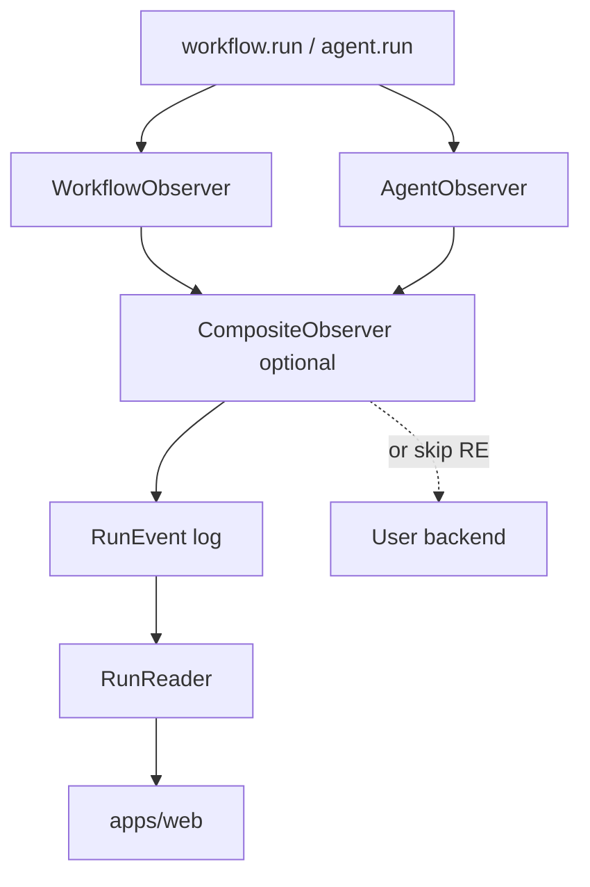

# Observability & persistence interfaces (draft)

Decouple ADL execution from **how** runs are recorded. Projects implement **observer** interfaces (push) and optional **store** interfaces (pull); the framework ships defaults (SQLite, SSE) but end code does not have to use them.

**Status:** Design only.

Related: [`streaming-api.md`](./streaming-api.md), [`workflow-api.md`](./workflow-api.md), [`agent-api.md`](./agent-api.md), [`message-store.md`](./message-store.md), [`project-api.md`](./project-api.md).

---

## Push vs pull

| Pattern | Role | Examples |
|---------|------|----------|
| **Observers** | Callbacks during execution | Log to console, OTEL spans, custom DB, bridge to UI |
| **Stores / readers** | Query after the fact | `getRun`, `listRuns`, `getEvents`, `MessageStore.load` |

Do **not** put `getRuns` on an observer class—observers are **write/listen** hooks. Query APIs belong on a **`RunReader`** (or your own DB layer).



---

## `WorkflowObserver`

One instance per **workflow run** (root). Registered on the project or passed into `createRunContext({ observers })`.

All methods optional. Receives stable ids from the runtime (`runId`, `stepId`, etc.).

```ts
interface WorkflowObserver {
  /** Run lifecycle */
  onRunStart?(e: {
    runId: string;
    workflowId: string;
    input: unknown;
    startedAt: Date;
  }): void | Promise<void>;

  onRunComplete?(e: {
    runId: string;
    workflowId: string;
    output: unknown;
    durationMs: number;
  }): void | Promise<void>;

  onRunCancel?(e: {
    runId: string;
    workflowId: string;
    reason?: string;
  }): void | Promise<void>;

  onRunError?(e: {
    runId: string;
    workflowId: string;
    error: unknown;
  }): void | Promise<void>;

  /** Step spans — see workflow-api step keys */
  onStepStart?(e: {
    runId: string;
    stepId: string;
    parentStepId: string | null;
    name: string;
    key?: string;
    path: string[];
  }): void | Promise<void>;

  onStepComplete?(e: {
    runId: string;
    stepId: string;
    name: string;
    key?: string;
    durationMs: number;
    output?: unknown;
  }): void | Promise<void>;

  onStepError?(e: {
    runId: string;
    stepId: string;
    name: string;
    key?: string;
    error: unknown;
  }): void | Promise<void>;

  /**
   * Application events from ctx.emit — see streaming-api.md.
   * Prefer this over abusing onStepComplete metadata.
   */
  onCustomEvent?(e: {
    runId: string;
    stepId: string;
    name: string;
    payload: unknown;
  }): void | Promise<void>;
}
```

**Naming:** `onStep*` maps to `step_started` / `step_finished` / `step_failed` in [`streaming-api.md`](./streaming-api.md). `onRunCancel` covers `AbortSignal` abort.

---

## `AgentObserver`

One logical observer type per **agent invocation** (`agent.run` / `agent.stream` episode), scoped to a parent `runId` + `stepId`.

```ts
interface AgentObserver {
  onAgentStart?(e: {
    runId: string;
    stepId: string;
    agentCallId: string;
    agentId: string;
    memoryScope: string;
  }): void | Promise<void>;

  /** Messages sent to the model for this episode (after load, bootstrap, user append). */
  onMessages?(e: {
    runId: string;
    stepId: string;
    agentCallId: string;
    messages: CoreMessage[];
  }): void | Promise<void>;

  /** Token / part streaming — only for agent.stream */
  onStream?(e: {
    runId: string;
    stepId: string;
    agentCallId: string;
    delta: string;
    /** Optional SDK chunk type if needed */
  }): void | Promise<void>;

  onToolCall?(e: {
    runId: string;
    stepId: string;
    agentCallId: string;
    toolCallId: string;
    toolName: string;
    args: unknown;
  }): void | Promise<void>;

  onToolResult?(e: {
    runId: string;
    stepId: string;
    agentCallId: string;
    toolCallId: string;
    toolName: string;
    result: unknown;
  }): void | Promise<void>;

  /** After persistence — committed assistant/tool messages for this episode */
  onMessagesCommitted?(e: {
    runId: string;
    stepId: string;
    agentCallId: string;
    memoryScope: string;
    newMessages: CoreMessage[];
  }): void | Promise<void>;

  onAgentComplete?(e: {
    runId: string;
    stepId: string;
    agentCallId: string;
    text: string;
    usage?: LanguageModelUsage;
    durationMs: number;
  }): void | Promise<void>;

  onAgentError?(e: {
    runId: string;
    stepId: string;
    agentCallId: string;
    error: unknown;
  }): void | Promise<void>;
}
```

**`onMessage` vs `onMessages`:** use **`onMessages`** for the full list sent to the model; **`onMessagesCommitted`** for what was appended to [`MessageStore`](./message-store.md). Avoid a separate `onMessage` per row unless a consumer needs it—can add later.

**`onToolCall` / `onToolResult`:** fire when tools execute (SDK auto-execute or workflow loop). Align with AI SDK tool-call / tool-result messages.

---

## Query APIs (`RunReader`, not observers)

```ts
interface RunReader {
  getRun(runId: string): Promise<RunSummary | null>;
  listRuns(filter?: { workflowId?: string; limit?: number }): Promise<RunSummary[]>;
  getRunEvents(runId: string, afterSeq?: number): Promise<RunEvent[]>;
}

interface RunSummary {
  runId: string;
  workflowId: string;
  status: "running" | "completed" | "failed" | "cancelled";
  startedAt: string;
  finishedAt?: string;
}
```

`apps/web` SSE route can tail **`getRunEvents`** or subscribe to an in-process bus fed by observers.

**`MessageStore`** remains a separate interface ([`message-store.md`](./message-store.md))—conversation transcripts, not run metadata.

---

## Wiring in a project

```ts
// adl.config.ts
import { createSqliteRunReader, createPersistingObservers } from "@agent-dev-lab/common"; // default impl
import { myWorkflowObserver } from "./observability";

export default {
  name: "my-research",
  workflows: { /* ... */ },

  observability: {
    workflow: [
      myWorkflowObserver,
      createPersistingObservers({ db }).workflow,
    ],
    agent: [
      createPersistingObservers({ db }).agent,
    ],
    /** Optional: single RunReader for UI / CLI */
    reader: createSqliteRunReader({ db }),
  },
} satisfies AdlProjectConfig;
```

Or pass per run:

```ts
const ctx = createRunContext(project, {
  workflowObservers: [new OtelWorkflowObserver()],
  agentObservers: [new OtelAgentObserver()],
});
await workflow.run(input, ctx);
```

Runtime **fans out** each hook to all registered observers (like `CompositeWorkflowObserver`).

---

## Relationship to `RunEvent` / SSE

Two layers, one direction:

1. **Ergonomic:** `WorkflowObserver` + `AgentObserver` (your sketch).
2. **Transport-friendly:** append-only **`RunEvent`** union for SSE and replay ([`streaming-api.md`](./streaming-api.md)).

Provide a default adapter in `@agent-dev-lab/common` (or runtime):

```ts
function observersToEventSink(observers: {
  workflow: WorkflowObserver[];
  agent: AgentObserver[];
}): RunEventSink;

function createEventBusReader(bus: RunEventSink): RunReader;
```

Projects may:

- Implement **only** observers (custom backend, no SQLite).
- Implement **only** `RunEventSink` / `RunReader` (event-sourced UI).
- Use **both** via the bundled adapter.

Execution code depends on **`WorkflowObserver` / `AgentObserver` interfaces**, not on Drizzle.

---

## OpenTelemetry

`OtelWorkflowObserver` / `OtelAgentObserver` implement the same interfaces: spans for run, step, agent call; attributes from `runId`, `stepId`, `agentCallId`. No separate OTEL API surface required.

---

## What the framework does internally

1. `createRunContext` builds `runId`, registers observers from config/options.
2. `ctx.step` → `onStepStart` / `onStepComplete` / `onStepError`.
3. `agent.run` / `agent.stream` → agent observer hooks + `MessageStore` commit.
4. Default persisting observer writes `RunEvent`s + run row for `RunReader`.
5. `apps/web` uses **`RunReader`** + SSE; does not import user workflow code.

**No `RunHandle`:** `runId` on `ctx`; observers + reader for everything else ([`project-api.md`](./project-api.md)).

---

## v1 checklist

- [ ] `WorkflowObserver` + `AgentObserver` types in runtime (interfaces only)
- [ ] Fan-out composite + invoke from step runner / agent runner
- [ ] `RunReader` + default SQLite impl in `@agent-dev-lab/common` (optional dep)
- [ ] Adapter: observers → `RunEvent` append log
- [ ] `adl.config` `observability` block (optional)
- [ ] `apps/web` SSE uses `RunReader.getRunEvents`

---

## Open questions

- Single `Observability` namespace vs split workflow/agent interfaces (keep split).
- Whether `onMessages` should redact system prompt by default.
- Sync vs async observers (await all in runner vs fire-and-forget with error logging).
- Per-project vs per-run observer lists only.
