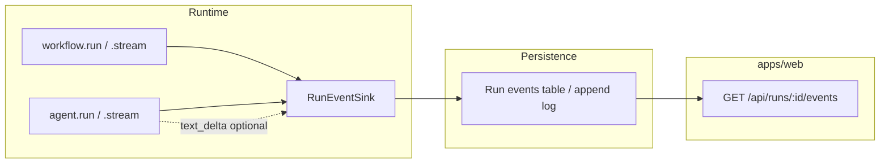

# Streaming & live runs (draft)

How ADL exposes **streaming** to callers and how the **inspection UI** (`apps/web`) receives live updates—whether or not the app uses `agent.stream` / `workflow.stream`.

**Status:** Design only. Not implemented.

Related: [`agent-api.md`](./agent-api.md), [`workflow-api.md`](./workflow-api.md), [`project-api.md`](./project-api.md).

---

## Two channels (do not conflate)

| Channel | What moves | When needed |
|---------|------------|-------------|
| **Run events** | Step tree, agent episodes, errors, committed messages, optional metadata | **Always** for waterfall / tracing UI—even when the model is non-streaming (`generateText`) |
| **Model stream** | Token (or part) deltas from `streamText` | When the user wants live text preview during an agent call |

The UI needs **run events** on every execution path. **Model stream** is optional and only exists when something calls `streamText` (usually `agent.stream`).



---

## Run events (framework primitive)

### Shape (sketch)

Union of versioned events, all include `runId` and monotonic `seq` (or timestamp + tie-break):

| `type` | Purpose |
|--------|---------|
| `run_started` | Workflow id, input snapshot (redacted), root `runId` |
| `step_started` / `step_finished` / `step_failed` | See [`workflow-api.md`](./workflow-api.md) |
| `agent_started` / `agent_finished` | `stepId`, `memoryScope`, agent `id` |
| `text_delta` | `stepId`, `agentCallId?`, `delta: string` — only when streaming model output |
| `messages_committed` | `stepId`, `memoryScope`, count / refs — after persistence |
| `run_finished` / `run_failed` | Workflow output or error |

Events are **JSON-serializable** for SQLite + SSE.

### `RunEventSink`

Not a `RunHandle`. A small **transport** interface (append-only events for SSE/replay). Prefer **`WorkflowObserver` / `AgentObserver`** for application hooks—see [`observability-api.md`](./observability-api.md). The default stack adapts observers → `RunEvent` → SQLite.

```ts
interface RunEventSink {
  emit(event: RunEvent): void | Promise<void>;
}

function createRunContext(project: LoadedAdlProject): WorkflowContext {
  const runId = generateId();
  const sink = createRunEventSink({ runId, project }); // or composite observers → events
  return { runId, /* step, ... */ };
}
```

- **`ctx.runId`** is available **before** `await workflow.run(...)` completes so the UI can subscribe immediately.
- **`workflow.run`** and **`workflow.stream`** both use the same sink and step events.
- No `cancel()` on the sink—use **`AbortSignal`** on run options ([`project-api.md`](./project-api.md)).

### Emitting without `agent.stream`

`agent.run` → `generateText`: emit `agent_started` / `agent_finished`, step events, `messages_committed` on finish. **No `text_delta`** unless we add a future “simulate stream from full text” (not v1).

Workflows that call the AI SDK **directly** inside a step should either:

- Use **`agent.stream`** / **`agent.run`** (recommended), or
- Call a helper that forwards SDK callbacks to the sink (below).

---

## Model streaming API

### `agent.stream`

Mirror of [`agent.run`](./agent-api.md) but delegates to **`streamText`**:

```ts
agent.stream({
  memoryScope: string;
  context?: Context;
  user?: string;
  messages?: CoreMessage[];
  signal?: AbortSignal;
}): AgentStreamResult;
```

**`AgentStreamResult`** (wraps AI SDK `StreamTextResult`):

- **`textStream`**, **`fullStream`**, etc. — re-export or delegate to SDK (caller can consume tokens).
- **`finished`: `Promise<AgentRunResult>`** — same persistence contract as `run` (`onFinish` / equivalent: commit `response.messages`, update `MessageStore`).
- While streaming: runner **`emit({ type: 'text_delta', delta, stepId, ... })`** from SDK `onChunk` (or `textStream` pump) into `RunEventSink`.

Persistence still happens **on finish**, not per delta—same as `run`, plus live deltas for UI.

### `workflow.stream`

Same as `workflow.run` for steps and run events; difference is only which child calls use `agent.stream` vs `agent.run`:

```ts
await workflow.stream(input, { project, signal });
// step tree events identical; text_delta appears when a step uses agent.stream
```

Alternatively a single entry with a flag:

```ts
workflow.run(input, { project, stream: true }); // if we want one method — TBD
```

**Recommendation:** **`run` + `stream` as two methods** on agent and workflow (clear types; `stream` return type includes stream handles).

### Helpers for “external” SDK use

When code inside a step calls **`streamText` / `generateText` directly** (not `agent.stream`), run events still need to reach the UI:

```ts
// Optional runtime helper (non-core path, exported utility)
pipeStreamTextToSink(result: StreamTextResult, {
  sink: RunEventSink;
  stepId: string;
  agentCallId?: string;
}): StreamTextResult;
```

Or lower-level:

```ts
trackModelStream({
  sink,
  stepId,
  stream: () => streamText({ ... }),
}): { textStream; finished: Promise<void> };
```

Document that **first-class** integration is `agent.stream`; helpers are for escape hatches.

---

## Getting data to `apps/web` (no `RunHandle`)

### Pattern: `runId` first, then subscribe

```ts
const ctx = createRunContext(project);
const outputPromise = workflow.run(input, ctx);

// Server route or client:
// subscribe(ctx.runId) while awaiting outputPromise
const output = await outputPromise;
```

### HTTP (planned)

| Route | Behavior |
|-------|----------|
| `POST /api/runs` | Body: `{ workflowId, input }` → `createRunContext`, start `workflow.run` **without blocking response** (or block until `run_started`), return **`{ runId }`** |
| `GET /api/runs/:runId/events` | **SSE** (or WebSocket) of persisted run events; live tail until `run_finished` |
| `GET /api/runs/:runId` | Snapshot: status derived from events, final output when done |

Implementation backs **`RunEventSink`** with append to SQLite (same DB family as [`message-store.md`](./message-store.md) / `@agent-dev-lab/common`) plus optional in-process fan-out for same-process dev.

### UI consumption

- **Waterfall / steps:** subscribe to `step_*` and `agent_*` events only—works for **`workflow.run`** (no model streaming).
- **Live transcript:** render `text_delta` + final `messages_committed` / message store for replay.
- **Polling fallback:** `GET` events since `?afterSeq=` if SSE unavailable.

Whether the project uses ADL’s **`agent.stream`** or raw **`streamText`**, the UI still works if **run events** are emitted (steps + `messages_committed`). Token preview needs **`text_delta`** or client-side read of stored messages after each agent episode.

---

## Cancellation

- Pass **`AbortSignal`** into `workflow.run` / `workflow.stream` / `agent.stream`.
- Forward to `streamText` / `generateText` and check in long-running steps.
- On abort: emit `run_failed` or `run_aborted`; partial deltas may exist; persistence policy TBD (commit partial messages vs rollback).

---

## Generics

Same type parameters as non-streaming paths:

- `defineAgent<Context, Tools>` → `stream(...)` typed `context`, `AgentStreamResult<Tools>`.
- `defineWorkflow<Input, Output>` → `stream` returns `Promise<Output>` plus stream side effects via sink (return type may include `StreamTextResult` only at agent level, not workflow).

---

## v1 phasing

| Phase | Deliverable |
|-------|-------------|
| **1** | `RunEventSink` + step events + `createRunContext` + persist events |
| **2** | SSE route in `apps/web` + waterfall from events |
| **3** | `agent.stream` + `text_delta` + `onFinish` persistence parity with `run` |
| **4** | `workflow.stream` (or document “use `run` + `agent.stream` in steps”) |
| **5** | `pipeStreamTextToSink` helper for raw SDK callers |

---

## Open questions

- Single `workflow.run({ streaming: true })` vs separate `.stream()` methods.
- Whether `text_delta` is scoped by `agentCallId` when multiple agents run in one step.
- Backpressure: `onChunk` async vs fire-and-forget emit to SSE.
- Multi-tenant / auth on run event routes (out of scope for playground).
