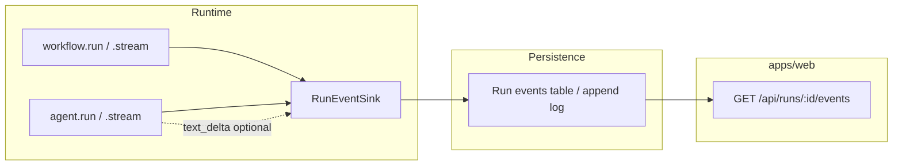

# Streaming & live runs (draft)

How ADL exposes **streaming** to callers and how the **inspection UI** (`apps/web`) receives live updates—whether or not the app uses `agent.stream` / `workflow.stream`.

**Status:** Design only. Not implemented.

Related: [`agent-api.md`](./agent-api.md), [`workflow-api.md`](./workflow-api.md), [`project-api.md`](./project-api.md).

---

## Two channels (do not conflate)

| Channel          | What moves                                                               | When needed                                                                                           |
| ---------------- | ------------------------------------------------------------------------ | ----------------------------------------------------------------------------------------------------- |
| **Run events**   | Step tree, agent episodes, errors, committed messages, optional metadata | **Always** for waterfall / tracing UI—even when the model is non-streaming (`generateText`)           |
| **Model stream** | Token (or part) deltas from `streamText`                                 | Live text / **reasoning** preview during an agent call; structured fields may finish at end of stream |

The UI needs **run events** on every execution path. **Model stream** is optional and only exists when something calls `streamText` (usually `agent.stream`).



---

## Run events (framework primitive)

### Shape (sketch)

Union of versioned events, all include `runId` and monotonic `seq` (or timestamp + tie-break):

| `type`                                           | Purpose                                                                      |
| ------------------------------------------------ | ---------------------------------------------------------------------------- |
| `run_started`                                    | Workflow id, input snapshot (redacted), root `runId`                         |
| `step_started` / `step_finished` / `step_failed` | See [`workflow-api.md`](./workflow-api.md)                                   |
| `agent_started` / `agent_finished`               | `stepId`, `memoryScope`, agent `id`                                          |
| `text_delta`                                     | `stepId`, `agentCallId?`, `delta: string` — only when streaming model output |
| `messages_committed`                             | `stepId`, `memoryScope`, count / refs — after persistence                    |
| `run_finished` / `run_failed`                    | Workflow output or error                                                     |

Events are **JSON-serializable** for SQLite + SSE.

### `RunEvent` and storage

Not a `RunHandle`. **`RunEvent`** is the SSE/replay shape. **Observers** push to stdout/OTEL (no reads). **`WorkflowStore.record*`** persists events for `getRunEvents` — see [`observability-api.md`](./observability-api.md).

```ts
function createRunContext(project: LoadedAdlProject): WorkflowContext {
  const runId = generateId();
  // fan-out: observers.onStepStart + workflowStore?.recordStepStart
  return { runId /* step, emit, ... */ };
}
```

- **`ctx.runId`** is available **before** `await workflow.run(...)` completes so the UI can subscribe immediately.
- **`workflow.run`** and **`workflow.stream`** both use the same sink and step events.
- No `cancel()` on the sink—use **`AbortSignal`** on run options ([`project-api.md`](./project-api.md)).

### One implementation path: always `streamText` inside the agent runner

**Yes** — implement both `agent.run` and `agent.stream` on top of **`streamText`**, not `generateText` + a separate path.

| Public API         | Caller sees                                            | Runner behavior                                                              |
| ------------------ | ------------------------------------------------------ | ---------------------------------------------------------------------------- |
| **`agent.run`**    | `Promise<AgentRunResult>` only                         | `streamText` + **drain** stream internally; resolve when generation finishes |
| **`agent.stream`** | `AgentStreamResult` (SDK streams + `finished` promise) | Same `streamText` call; **expose** `textStream` / `fullStream` to caller     |

Reasons:

- **One place** for `onChunk`, `onStepFinish`, tool calls, persistence, [`AgentObserver`](./observability-api.md) hooks.
- **`agent.run` still supplies stream-shaped observability** (`onStream`, tool events) without forcing the caller to read a stream.
- AI SDK already unifies final result on `streamText` (`text`, `response.messages`, `usage` on completion).

```ts
// Internal (conceptual)
async function executeAgentEpisode(options: AgentRunOptions): Promise<{
  result: AgentRunResult;
  stream: StreamTextResult; // only returned to agent.stream callers
}> {
  const streamResult = streamText({
    model: agent.model,
    tools: agent.tools,
    messages: preparedMessages,
    experimental_context: options.context,
    abortSignal: options.signal,
    stopWhen: stepCountIs(1), // one episode per agent.run; workflow loops externally
    onChunk: ({ chunk }) => {
      if (chunk.type === "text-delta") {
        observers.agent.onStream?.({ delta: chunk.textDelta, ...ids });
        emitRunEvent({ type: "text_delta", delta: chunk.textDelta, ... });
      }
      // forward other chunk types as needed (tool-input-start, etc.)
    },
    onStepFinish: (step) => {
      // tool calls / results for observers
    },
    onFinish: async ({ response }) => {
      await messageStore.append(memoryScope, response.messages);
      observers.agent.onMessagesCommitted?.({ newMessages: response.messages, ... });
    },
  });

  // agent.run: consume until done without exposing stream
  const text = await streamResult.text; // or consume textStream
  const result = buildAgentRunResult(streamResult);
  return { result, stream: streamResult };
}
```

**Caller using `agent.run`:** awaits the promise; UI still receives **`text_delta`** via observers / run event log if subscribed.

**Optional flag** `emitModelDeltas: false` on a run (or observer no-op) if a batch job wants less noise—default **on** when observers are registered.

Workflows that call the SDK **directly** should use shared **`executeAgentEpisode`** or `pipeStreamTextToObservers` helpers—avoid a third copy.

---

## Model streaming API

### `agent.stream`

Same episode executor as `run`, but returns SDK handles:

```ts
agent.stream({ memoryScope, context?, user?, signal? }): AgentStreamResult;
```

**`AgentStreamResult`:**

- **`textStream`**, **`fullStream`**, … — from underlying `StreamTextResult`.
- **`finished: Promise<AgentRunResult>`** — same persistence as `run` (store updated on SDK finish).
- Observers / run events fire **identically** to `run` (including `onStream`).

### `agent.run`

```ts
await agent.run({ ... }); // Promise<AgentRunResult> — drains streamText internally
```

No duplicate persistence logic; no missing tool/stream events compared to `agent.stream`.

---

## Workflow streaming & custom events

### Framework events (fixed union)

Be **intentional** about built-in [`RunEvent`](./streaming-api.md) types—only what the UI and `RunReader` rely on:

- Run: `run_started`, `run_finished`, `run_failed`, `run_cancelled`
- Step: `step_started`, `step_finished`, `step_failed`
- Agent: `agent_started`, `agent_finished`, `text_delta`, `tool_call`, `tool_result`, `messages_committed`

Do not overload this union with ad-hoc domain events.

### Custom events via `ctx`

Workflow code emits **application-defined** events on the same log/SSE channel:

```ts
await ctx.step("ingest", async ({ ctx }) => {
  ctx.emit({
    type: "custom",
    name: "files_scanned",
    payload: { count: 42 },
  });

  for (const file of files) {
    ctx.emit({ type: "custom", name: "file_progress", payload: { id: file.id } });
    // ...
  }
});
```

**Rules:**

- `ctx.emit` only valid **inside an active step** (has `stepId`, `runId`).
- `name` is a project-defined string; **`payload`** JSON-serializable.
- UI: subscribe to run events; render `custom` with a project-provided component map or generic JSON view.
- Optional Zod registry in `adl.config` for known custom event names (validation in dev, not required).

Maps to [`WorkflowObserver`](./observability-api.md) via adapter: `onCustomEvent?` or generic `onRunEvent`.

### `workflow.run` vs `workflow.stream`

|        | **`workflow.run`**                 | **`workflow.stream`**                                                           |
| ------ | ---------------------------------- | ------------------------------------------------------------------------------- |
| Return | `Promise<Output>`                  | Same (stream is observability-side, not a second return type)                   |
| Steps  | Same `ctx.step`                    | Same                                                                            |
| Agents | `agent.run` (drained `streamText`) | Often `agent.stream` when caller wants token access; still same observer events |
| Custom | `ctx.emit`                         | `ctx.emit`                                                                      |

We likely **do not** need a separate `workflow.stream()` unless we later expose a merged readable stream of all run events. For v1: **`workflow.run` + event tail** is enough; “workflow streaming” = run event SSE + optional `agent.stream` inside steps.

### Helpers for raw SDK use

When a step calls **`streamText` directly**, route through:

```ts
executeStreamTextWithObservers({ ...streamTextArgs }, { observers, ids });
```

Same as the internal agent runner hookup.

---

## Getting data to `apps/web` (no `RunHandle`)

### Pattern: `runId` first, then subscribe

```ts
const ctx = createRunContext(project);
const outputPromise = workflow.run(input, ctx);

// Server route or client:
// subscribe(ctx.runId) while awaiting outputPromise
const output = await outputPromise;
```

### HTTP (planned)

| Route                         | Behavior                                                                                                                                                      |
| ----------------------------- | ------------------------------------------------------------------------------------------------------------------------------------------------------------- |
| `POST /api/runs`              | Body: `{ workflowId, input }` → `createRunContext`, start `workflow.run` **without blocking response** (or block until `run_started`), return **`{ runId }`** |
| `GET /api/runs/:runId/events` | **SSE** (or WebSocket) of persisted run events; live tail until `run_finished`                                                                                |
| `GET /api/runs/:runId`        | Snapshot: status derived from events, final output when done                                                                                                  |

Implementation backs **`RunEventSink`** with append to SQLite (same DB family as [`message-store.md`](./message-store.md) / `@agent-dev-lab/common`) plus optional in-process fan-out for same-process dev.

### UI consumption

- **Waterfall / steps:** subscribe to `step_*` and `agent_*` events only—works for **`workflow.run`** (no model streaming).
- **Live transcript:** render `text_delta` + final `messages_committed` / message store for replay.
- **Polling fallback:** `GET` events since `?afterSeq=` if SSE unavailable.

Whether the project uses ADL’s **`agent.stream`** or raw **`streamText`**, the UI still works if **run events** are emitted (steps + `messages_committed`). Token preview needs **`text_delta`** or client-side read of stored messages after each agent episode.

---

## Cancellation

- Pass **`AbortSignal`** into `workflow.run` / `workflow.stream` / `agent.stream`.
- Forward to `streamText` / `generateText` and check in long-running steps.
- On abort: emit `run_failed` or `run_aborted`; partial deltas may exist; persistence policy TBD (commit partial messages vs rollback).

---

## Generics

Same type parameters as non-streaming paths:

- `createAgent<Context, Tools>` → `stream(...)` typed `context`, `AgentStreamResult<Tools>`.
- `createWorkflow<Input, Output>` → `stream` returns `Promise<Output>` plus stream side effects via sink (return type may include `StreamTextResult` only at agent level, not workflow).

---

## v1 phasing

| Phase | Deliverable                                                                    |
| ----- | ------------------------------------------------------------------------------ |
| **1** | Observers + `createRunContext` + step/run events + `ctx.emit` custom           |
| **2** | SSE route in `apps/web` + waterfall from events                                |
| **3** | `executeAgentEpisode` via `streamText` for both `agent.run` and `agent.stream` |
| **4** | `agent.stream` exposes SDK streams; `agent.run` drains                         |
| **5** | `executeStreamTextWithObservers` helper for raw SDK in steps                   |

---

## Open questions

- Single `workflow.run({ streaming: true })` vs separate `.stream()` methods.
- Whether `text_delta` is scoped by `agentCallId` when multiple agents run in one step.
- Backpressure: `onChunk` async vs fire-and-forget emit to SSE.
- Multi-tenant / auth on run event routes (out of scope for playground).
