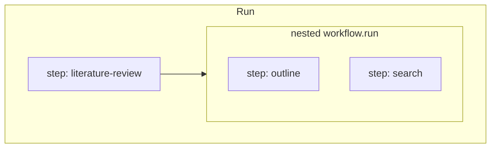

# Workflow API (draft)

Design notes for **workflows**, **steps**, **templates**, and run observability (waterfall / tracing). Complements [`agent-api.md`](./agent-api.md) and [`message-store.md`](./message-store.md).

**Status:** Design for v1 planning. **Not implemented** in `@agent-dev-lab/runtime`.

---

## Goals

- **Pure TypeScript** orchestration: `if` / `for` / `try` / `await` / `Promise.all` — no graph DSL.
- **Nestable steps** with a clear **active / completed** tree for inspection UI (waterfall, tracing).
- **Reusable workflows** with explicit **input/output** when you want a typed contract.
- **Templates** usable anywhere via `.render()` — not tied to `WorkflowContext`.
- **Runtime/UI split**: append-only **run events**; UI reconstructs the step tree from events.

---

## Two composition primitives

| | **`ctx.step`** | **Nested workflow** (`defineWorkflow` + `run`) |
|---|----------------|--------------------------------------------------|
| **Purpose** | Observability + logical span boundary | Reusable unit with typed **input → output** |
| **Contract** | None enforced; callback closure captures anything | `input` / `output` schemas (e.g. Zod) on the workflow |
| **Reuse** | Copy-paste or extract plain TS functions yourself | Call `otherWorkflow.run(input, childCtx)` |
| **Tracing** | Always creates a step node (with path + invocation id) | Outer step can wrap inner `run`; inner workflow may define its own steps |
| **Best for** | “Do this chunk of work under a span” | “This sub-process is a named, testable module” |

**Recommendation: include both.** They solve different problems. Nesting workflows does not replace steps: you typically **`step` around a nested `run`** if you want the sub-workflow visible as one bar in a waterfall, and use **inner steps** inside that workflow for detail.

**Pure TS default:** a nested workflow is just an async function with metadata:

```ts
export const searchPapers = defineWorkflow({
  id: "search-papers",
  input: z.object({ topic: z.string() }),
  output: z.object({ papers: z.array(z.string()) }),
  async run(input, ctx) {
    // ...
    return { papers: [] };
  },
});

// Inside another workflow:
await ctx.step("search", async (step) => {
  const { papers } = await searchPapers.run({ topic }, step);
  return papers;
});
```

You can also call **`searchPapers.run` without `step`** when you do not need an extra span (e.g. trivial helper). That remains valid TypeScript; you trade away a dedicated step node unless the inner workflow emits its own steps.

### When to use which

- **Only `step`**: one-off script, exploratory flow, closure-heavy glue, no stable I/O contract.
- **Only nested workflow** (no wrapping step): internal helper the UI should not show separately; or top-level entry is already one workflow.
- **`step` + nested workflow**: reusable module **and** visible span in the waterfall (common case).
- **Plain function** (no `defineWorkflow`): private helper inside a file; promote to `defineWorkflow` when you need registry, docs, or typed `run` from CLI/UI.

---

## Step tree, nesting, and observability

### Requirements

1. Steps can nest: `step` callbacks receive a **child context** whose `step` calls create deeper nodes.
2. The runtime knows **which steps are active** (stack) and **which completed** (events + ordering).
3. UI can build a **waterfall / flame graph**: parent spans contain children; siblings ordered by start time; parallel branches overlap in time.

### API updates needed (yes)

A single flat `ctx` is not enough. Use:

- **`stepId`**: unique per **invocation** (UUID). Never reused in a run.
- **`stepPath`**: logical location in the tree, e.g. `["literature-review", "search", "2"]` where `"2"` is the loop index segment.
- **`name`**: human label passed to `step("search", ...)`.
- **Child context**: nested `step` only on the child (or explicit `step` factory) so the runtime can push/pop the active stack.

```ts
type StepIdentity = {
  stepId: string;
  name: string;
  path: string[];       // segments for grouping / display
  parentStepId: string | null;
  attempt: number;      // 0-based: same name+parent, Nth invocation
};

await ctx.step("outline", async (step) => {
  await step.step("draft", async (draft) => {
  });
});
```

### Events (for UI + tracing)

Emit on the run event log (SQLite later):

| Event | Payload (minimal) |
|-------|-------------------|
| `step_started` | `stepId`, `parentStepId`, `name`, `path`, `attempt`, `startedAt` |
| `step_finished` | `stepId`, `status: "ok" \| "error"`, `durationMs`, optional **serialized output** (see below) |
| `step_failed` | `stepId`, `error` |

**Active steps** at any time = nodes with `step_started` and no matching terminal event. No extra API on `ctx` required for the UI if events are complete; optional `ctx.activeSteps()` can read that projection in-process.

OpenTelemetry: one span per `stepId`, parent span id = parent step’s span.

### Repeated `step("same-name")` in loops

The **name alone is not unique**. The runtime should assign:

- **`attempt`**: increment per `(parentStepId, name)` — first call `0`, second `1`, …
- **`path` segment**: include attempt or loop index, e.g. `search/2` or `search#2`

Optional explicit disambiguation when auto-index is unclear:

```ts
for (const topic of topics) {
  await ctx.step("search", async (step) => {
    // ...
  }, { key: topic }); // path uses stable key instead of only attempt index
}
```

**API shape (v1):**

```ts
step<T>(
  name: string,
  fn: (step: WorkflowContext) => Promise<T>,
  options?: { key?: string },  // optional stable segment for path
): Promise<T>;
```

Closure captures loop variables; **do not** rely on the runtime to infer inputs from the closure.

---

## Step inputs and outputs

### Inputs

Anything in the closure (including `ctx`, agents, prior results) can drive the step. The framework **does not** automatically capture “step inputs” from closure scope — that would require brittle static analysis or forced parameter objects.

**Acceptable v1:**

- **No declared step inputs** on the API.
- Optional **manual** `step.setMetadata({ ... })` or return value only.
- If you need auditable inputs, use a **nested workflow** with a Zod `input` object, or pass a plain object you log yourself at the start of the step.

### Outputs

- **`return` value** from the step callback: serialized in `step_finished` when JSON-safe (size limits / redaction TBD).
- **Errors**: propagate; emit `step_failed`; parent step fails unless caught in user TS.

This is the main **semantic difference** from nested workflows: workflows **declare** inputs; steps **only** declare behavior via TypeScript closure.

---

## `Promise.all` and concurrency

`ctx.step` returns a **`Promise`**. Use standard Promise APIs:

```ts
const [outline, seed] = await Promise.all([
  ctx.step("outline", () => outlineWork()),
  ctx.step("seed", () => seedWork()),
]);
```

**Runtime behavior:**

- Each call allocates a **distinct `stepId`** before awaiting `fn`.
- Siblings share the same `parentStepId` but different paths/attempts.
- Active stack may hold **multiple** step ids simultaneously — required for correct parallel waterfall.

No special `ctx.step.all` required for v1; document that **`Promise.all` / `Promise.allSettled` / `race`** are the supported patterns. Optional sugar later if needed.

---

## Templates (not on `ctx`)

Templates are **standalone values** with validation and `.render()`:

```ts
import { template } from "@agent-dev-lab/runtime";
import { z } from "zod";

export const findPapersPrompt = template({
  path: "./prompts/find-papers.md",
  data: z.object({
    topic: z.string(),
    maxResults: z.number().int().positive(),
  }),
});

// Anywhere: workflow, agent runner, tests, CLI
const text = findPapersPrompt.render({
  topic: "CRISPR",
  maxResults: 10,
});
```

- **No `ctx.render`** — context-specific values are passed as **render arguments** (or closed over in TS before calling `render`).
- Agent `instructions` uses the same `template()` helper ([`agent-api.md`](./agent-api.md)).
- Workflow steps pass rendered strings to `agent.run({ user: findPapersPrompt.render({...}) })`.

If a template needs run metadata, the **caller** passes it explicitly:

```ts
findPapersPrompt.render({ topic, maxResults, runId: ctx.runId });
```

(Extend the Zod schema when those fields are real.)

---

## `WorkflowContext` (sketch)

Shared across a run; **child contexts** narrow scope for nesting.

```ts
type WorkflowContext = {
  readonly runId: string;
  readonly stepId: string | null;      // null only on root before first step
  readonly stepPath: string[];
  readonly parentStepId: string | null;

  step: StepFn;

  /** Invoke another workflow with explicit input; child ctx for inner steps. */
  // Sugar: searchPapers.run(input, ctx) may accept WorkflowContext directly

  /** Helpers */
  readonly memoryScope: (suffix: string) => string;  // convention helper
  emit?: (event: string, payload: unknown) => void; // advanced
};

type StepFn = <T>(
  name: string,
  fn: (step: WorkflowContext) => Promise<T>,
  options?: { key?: string },
) => Promise<T>;
```

`defineWorkflow` attaches `id`, `input`, `output`, and exposes:

```ts
workflow.run(input, ctx?): Promise<Output>;
```

Top-level entry (`runWorkflow(workflow, input)`) creates root `ctx` with `runId`, empty path, event sink.

---

## Relationship to agents and memory

- **`memoryScope`**: workflow chooses conventions, e.g. `` `${ctx.runId}:${ctx.stepPath.join("/")}` `` or `ctx.memoryScope("researcher")` helper — see [`agent-api.md`](./agent-api.md).
- **`context`** on `agent.run`: set in workflow TS from `ctx` fields (run id, user id, etc.).
- Agent calls usually happen **inside** a step so the waterfall shows model work under the right span; agent invocations emit their own child events (conversation nodes) under the current `stepId`.

---

## Nesting workflows vs nesting steps (summary)



- **Outer step** = one bar (optional).
- **Inner steps** = detail inside that module.
- **Workflow boundary** = typed I/O, registry, CLI listing — not a tracing primitive by itself.

---

## Implementation status

| Piece | Status |
|-------|--------|
| `defineWorkflow` | Not implemented |
| `WorkflowContext` / `step` | Not implemented |
| Run event log / step tree | Not implemented |
| `template()` with Zod `.render()` | Partial: `renderPromptTemplate` + `loadPromptFile` only |

---

## v1 checklist

- [ ] `template({ path, data })` with `.render()` (Zod validation)
- [ ] `defineWorkflow` + typed `run(input, ctx)`
- [ ] `ctx.step(name, fn, options?)` with **child context** and `stepId` / `path` / `attempt`
- [ ] Run events: `step_started`, `step_finished`, `step_failed`
- [ ] Parallel steps via `Promise.all` (documented)
- [ ] `runWorkflow` entry + `runId` generation
- [ ] Helpers: `memoryScope(suffix)` (optional)
- [ ] Link agent/run events to `parentStepId`

---

## Open questions

- Max size / redaction for serialized step return values in events.
- Whether `defineWorkflow.run` requires `ctx` or creates a child automatically when omitted.
- Cancellation / `AbortSignal` propagation through `step` and nested workflows.
- Idempotency / replay keys for steps (future).
