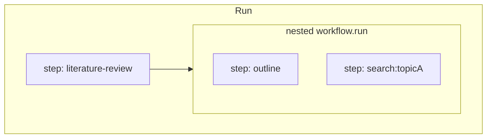

# Workflow API (draft)

Design notes for **workflows**, **steps**, **templates**, and run observability (waterfall / tracing). Complements [`agent-api.md`](./agent-api.md) and [`message-store.md`](./message-store.md).

**Status:** Design for v1 planning. **Not implemented** in `@agent-dev-lab/runtime`.

Project discovery & `runWorkflow`: [`project-api.md`](./project-api.md).

---

## Goals

- **Pure TypeScript** orchestration: `if` / `for` / `try` / `await` / `Promise.all` — no graph DSL.
- **Nestable steps** with a clear **active / completed** tree for inspection UI (waterfall, tracing).
- **Reusable workflows** with explicit **input/output** when you want a typed contract.
- **Templates** usable anywhere via `.render()` — not tied to `WorkflowContext`.
- **Runtime/UI split**: append-only **run events**; UI reconstructs the step tree from events.

---

## Two composition primitives

| | **`ctx.step`** | **Nested workflow** (`defineWorkflow` + `run`) |
|---|----------------|--------------------------------------------------|
| **Purpose** | Observability + logical span boundary | Reusable unit with typed **input → output** |
| **Contract** | None enforced; callback closure captures anything | `input` / `output` schemas (e.g. Zod) on the workflow |
| **Reuse** | Copy-paste or extract plain TS functions yourself | Call `otherWorkflow.run(input, childCtx)` |
| **Tracing** | Always creates a step node (with stable path + invocation id) | Outer step can wrap inner `run`; inner workflow may define its own steps |
| **Best for** | “Do this chunk of work under a span” | “This sub-process is a named, testable module” |

**Recommendation: include both.** They solve different problems. Nesting workflows does not replace steps: you typically **`step` around a nested `run`** if you want the sub-workflow visible as one bar in a waterfall, and use **inner steps** inside that workflow for detail.

**Pure TS default:** a nested workflow is just an async function with metadata:

```ts
export const searchPapers = defineWorkflow({
  id: "search-papers",
  input: z.object({ topic: z.string() }),
  output: z.object({ papers: z.array(z.string()) }),
  async run(input, ctx) {
    // ...
    return { papers: [] };
  },
});

// Inside another workflow:
await ctx.step("search", async ({ ctx: child }) => {
  const { papers } = await searchPapers.run({ topic }, child);
  return papers;
});
```

You can also call **`searchPapers.run` without `step`** when you do not need an extra span (e.g. trivial helper). That remains valid TypeScript; you trade away a dedicated step node unless the inner workflow emits its own steps.

### When to use which

- **Only `step`**: one-off script, exploratory flow, closure-heavy glue, no stable I/O contract.
- **Only nested workflow** (no wrapping step): internal helper the UI should not show separately; or top-level entry is already one workflow.
- **`step` + nested workflow**: reusable module **and** visible span in the waterfall (common case).
- **Plain function** (no `defineWorkflow`): private helper inside a file; promote to `defineWorkflow` when you need registry, docs, or typed `run` from CLI/UI.

---

## Step tree, nesting, and observability

### Requirements

1. Steps can nest: the step callback receives a **child `ctx`** (same type, narrowed parent/step ids).
2. The runtime knows **which steps are active** (stack) and **which completed** (events + ordering).
3. UI can build a **waterfall / flame graph**: parent spans contain children; siblings ordered by start time; parallel branches overlap in time.

### Step callback shape

Reuse the name **`ctx`** for the child context (destructured for clarity):

```ts
await ctx.step("outline", async ({ ctx }) => {
  await ctx.step("draft", async ({ ctx }) => {
    // ...
  });
});
```

Nested workflow `run(input, ctx)` accepts that same child `ctx`.

### Identity fields

| Field | Meaning |
|-------|---------|
| **`stepId`** | Unique per invocation (UUID). Never reused in a run. |
| **`name`** | Human label: first argument to `step("…", …)`. |
| **`key`** | Optional disambiguator (React-style). See below. |
| **`stepPath`** | Stable logical path: segments derived from `(name, key)` ancestry, not auto-increment counters. |
| **`parentStepId`** | Parent invocation, or `null` at run root. |

```ts
type StepIdentity = {
  stepId: string;
  name: string;
  key: string | undefined;
  path: string[];              // e.g. ["literature-review", "search:crispr"]
  parentStepId: string | null;
};
```

**Path encoding:** each segment is `name` when `key` is omitted, or `` `${name}:${key}` `` when keyed (exact encoding TBD; must be stable and injective per parent).

We intentionally **do not** use auto-increment attempt indices (`search/1` vs `search`) — a loop that runs once would produce a different path shape than a direct call, which is confusing in the UI.

### Step keys (required for repeats; React-like)

Under a given **parent step**, the pair **`(name, key)`** identifies a logical step slot for the whole run:

| Rule | Behavior |
|------|----------|
| **First** `step("foo", …)` under a parent with no `key` | Allowed. Treat as `(name, key = undefined)` — the single default slot for that name. |
| **Second+** `step("foo", …)` under the same parent | **`key` is required** in `options`. If omitted → **throw** (forces explicit disambiguation). |
| **Duplicate `(name, key)`** under the same parent | **Throw** — slot already used (whether still active or completed). Keys must be unique per `(parentStepId, name)`. |
| **Parallel** `step("foo", …)` with the same `name` | **Must** use distinct `keys` (same as repeating in a loop). |

Loops:

```ts
for (const topic of topics) {
  await ctx.step(
    "search",
    async ({ ctx }) => {
      /* ... */
    },
    { key: topic },
  );
}
```

Single call (no repeat) — key omitted:

```ts
await ctx.step("outline", async ({ ctx }) => {
  /* ... */
});
```

This matches the React mental model: list items need `key`; a single child does not.

### Parallelism warning

**Do not** run multiple `step("same-name", …)` in parallel (e.g. `Promise.all`) **without** distinct `key`s.

If you do, the runtime will throw when registering the second slot (duplicate implicit `undefined` key), or you must opt into unsafe behavior (see escape hatch below).

Even if execution “works,” sibling ordering in the waterfall and event log may be **non-deterministic** relative to wall-clock start order. For inspectable runs, use explicit keys:

```ts
await Promise.all(
  topics.map((topic) =>
    ctx.step("search", async ({ ctx }) => { /* ... */ }, { key: topic }),
  ),
);
```

**Escape hatch (optional, v1 or later):** `options.allowDuplicateName?: true` or `unsafeParallel?: true` disables key enforcement for that call only — documented as “waterfall order may be nondeterministic; not for production inspection.” Default remains strict.

### Events (for UI + tracing)

| Event | Payload (minimal) |
|-------|-------------------|
| `step_started` | `stepId`, `parentStepId`, `name`, `key`, `path`, `startedAt` |
| `step_finished` | `stepId`, `status: "ok" \| "error"`, `durationMs`, optional serialized **return value** |
| `step_failed` | `stepId`, `error` |

**Active steps** = `step_started` without a terminal event. Optional `ctx.activeSteps()` can project this in-process.

OpenTelemetry: one span per `stepId`; parent link = `parentStepId`.

---

## Step inputs and outputs

### Inputs

Anything in the closure (including `ctx`, agents, prior results) can drive the step. The framework **does not** capture “step inputs” from the closure.

- **No declared step inputs** on the step API.
- For auditable inputs → **nested workflow** with Zod `input`, or log metadata manually at step start.

### Outputs

- **Return value** from the callback → optional JSON in `step_finished` (size limits / redaction TBD).
- **Errors** propagate; `step_failed` on the step; parent fails unless caught in user TS.

**Difference from nested workflows:** workflows **declare** inputs; steps **only** use closure + return.

---

## `Promise.all` and concurrency

`ctx.step` returns a **`Promise`**. Use standard APIs: `Promise.all`, `allSettled`, `race`, etc.

Each call gets its own **`stepId`**. Parallel siblings need **distinct `key`s** when they share a `name` (see above).

No `ctx.step.all` required for v1.

---

## Templates (not on `ctx`)

Templates are **standalone values** with validation and `.render()`:

```ts
export const findPapersPrompt = template({
  path: "./prompts/find-papers.md",
  data: z.object({ topic: z.string(), maxResults: z.number().int().positive() }),
});

const text = findPapersPrompt.render({ topic: "CRISPR", maxResults: 10 });
```

- **No `ctx.render`** — pass run-specific fields as render args: `findPapersPrompt.render({ ..., runId: ctx.runId })`.
- See [`agent-api.md`](./agent-api.md) for agent `instructions`.

---

## `WorkflowContext` (sketch)

```ts
type WorkflowContext = {
  readonly runId: string;
  readonly stepId: string | null;
  readonly stepPath: string[];
  readonly parentStepId: string | null;

  step: StepFn;

  readonly memoryScope: (suffix: string) => string;
  emit?: (event: string, payload: unknown) => void;
};

type StepOptions = {
  /** Required when invoking the same `name` again under the same parent; must be unique per (parent, name). */
  key?: string;
  /** Escape hatch: skip key enforcement (nondeterministic parallel ordering). */
  allowDuplicateName?: boolean;
};

type StepFn = <T>(
  name: string,
  fn: (args: { ctx: WorkflowContext }) => Promise<T>,
  options?: StepOptions,
) => Promise<T>;
```

`defineWorkflow` exposes:

```ts
workflow.run(
  input: Input,
  options: WorkflowContext | { project: LoadedAdlProject; signal?: AbortSignal },
): Promise<Output>;
```

- Returns **`Promise<Output>`** only — no core **`RunHandle`** (see [`project-api.md`](./project-api.md)).
- Root run: pass `{ project }` so the runtime creates `ctx` with a new `runId` and event sink.
- Nested run: pass child `ctx` from `step(async ({ ctx }) => …)`.
- **`signal`**: optional `AbortSignal` for cancellation (checked in steps / forwarded to agents).

---

## Relationship to agents and memory

- **`memoryScope`**: derive from `runId` + `stepPath` / `stepId` conventions — see [`agent-api.md`](./agent-api.md).
- **`context`** on `agent.run`: built from workflow `ctx` in plain TS.
- Prefer agent calls **inside** `step` so the waterfall attributes work to the right span.

---

## Nesting workflows vs nesting steps



- **Outer step** = optional summary bar.
- **Inner steps** = detail, keyed when repeated.
- **Workflow** = typed I/O + reuse, not a tracing primitive by itself.

---

## Implementation status

| Piece | Status |
|-------|--------|
| `defineWorkflow` | Not implemented |
| `WorkflowContext` / `step` | Not implemented |
| Step key registry + errors | Not implemented |
| Run event log / step tree | Not implemented |
| `template()` with Zod `.render()` | Partial: `renderPromptTemplate` + `loadPromptFile` only |

---

## v1 checklist

- [ ] `template({ path, data })` with `.render()` (Zod)
- [ ] `defineWorkflow` + typed `run(input, ctx)`
- [ ] `ctx.step(name, async ({ ctx }) => …, options?)` with child `ctx`
- [ ] Key rules: require `key` on repeat; throw on duplicate `(parent, name, key)`
- [ ] Document parallel same-`name` requires distinct keys
- [ ] Run events: `step_started`, `step_finished`, `step_failed` (`name`, `key`, `path`)
- [ ] `Promise.all` patterns in docs/examples
- [ ] `runWorkflow` + `runId`
- [ ] Agent events linked to `stepId`

---

## Open questions

- Exact `path` segment encoding (`name:key` vs nested objects in events).
- Whether completed steps release `(name, key)` slots for replay/idempotency (default: no — keys are run-scoped).
- Max size / redaction for serialized step return values.
- `AbortSignal` through `step` and nested workflows.
